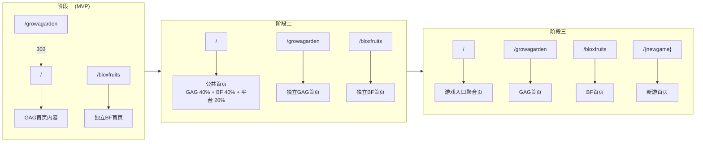

# 新游拓展专项 PRD

## 一、需求背景

### 1.1 项目现状
网站当前主要服务 **Grow a Garden** 游戏玩家，提供道具价值、道具 Wiki、交易价值计算器、文章内容、宠物管理等功能。

### 1.2 扩展计划
随着用户搜索需求与扩展计划，我们计划支持第二款 Roblox 游戏 **Blox Fruits**。

> **Blox Fruits** 是一款基于《海贼王》灵感制作的 Roblox 动作冒险游戏，玩家通过获取和使用各种"果实"获得特殊能力，在开放世界中刷怪升级、打 Boss、PvP 对战并探索多个海域，是 Roblox 上人气最高、玩法最丰富的刷级与战斗类游戏之一。
> 
> 游戏链接：https://www.roblox.com/games/2753915549/Blox-Fruits#!/about

### 1.3 需求目标

1. 支持 Blox Fruits 可交易道具的价值展示、Wiki 信息、交易系统、列表功能、文章内容等功能
2. 在不破坏现有 GAG 功能的前提下，新增一套独立的 Blox Fruits 功能区域
3. 形成多游戏架构的基础，为未来扩展第 3 款或更多游戏打下基础
4. 能抽象成配置或组件的，尽量抽象，以便后续更快速的增加新游戏

---

## 二、基础框架设计

### 2.1 首页分阶段渐进式改版

根据游戏数量的增长，首页架构分三个阶段逐步演进：

#### 阶段一：GAG为主 + BF软入口（MVP）

| 维度 | 说明 |
|------|------|
| **基础条件** | BF基础页面完成 |
| **`/` 首页** | GAG首页内容为主（约80%），增加BF入口模块（约20%） |
| **`/growagarden`** | 302重定向到 `/` |
| **`/bloxfruits`** | 独立BF首页，新建；页面结构大部分复用现有首页 |
| **SEO重心** | `/` 仍聚焦GAG关键词；BF入口模块提供内链铺垫 |

```
用户访问 /growagarden → 302临时重定向 → / (GAG首页同时也是公共首页)
用户访问 /bloxfruits → 独立BF首页
```
**预期效果：**
- Google继续索引 / 为GAG首页
- /growagarden 不会被独立索引
- 如果用户直接访问 /growagarden，会跳转到 /
- 未来转换方便，不影响现有排名


#### 阶段二：双游戏公共首页

| 维度 | 说明 |
|------|------|
| **条件** | 阶段一上线1个月后 + BF全部页面就绪 + BF页面已有一定搜索曝光量 |
| **`/` 首页** | 公共首页：GAG模块(40%) + BF模块(40%) + 平台品牌介绍(20%) |
| **`/growagarden`** | 删除302重定向，成为独立GAG首页（原 `/` 的GAG内容迁移至此） |
| **`/bloxfruits`** | 保持独立BF首页 |
| **SEO重心** | `/` 目标多游戏品牌词；各游戏首页聚焦各自关键词 |

```
用户访问 / → 公共首页（双游戏入口+品牌介绍）
用户访问 /growagarden → 独立GAG首页
用户访问 /bloxfruits → 独立BF首页
```
预期效果：/ 和 /growagarden两个URL都独立被Google索引，且总的搜索流量增加

**可能的影响和应对方案：**


#### 阶段三：多游戏入口聚合（3款及以上）

| 维度 | 说明 |
|------|------|
| **条件** | 支持第3款游戏时 |
| **`/` 首页** | 纯游戏入口聚合页 + 平台品牌 |
| **各游戏首页** | `/growagarden`、`/bloxfruits`、`/{newgame}` 各自独立 |
| **SEO重心** | `/` 聚焦平台品牌 + 通用"Roblox trading"关键词 |



### 2.2 URL结构规范

| 类型 | URL结构 | 示例 |
|------|---------|------|
| 游戏首页 | `/{gameKey}` | `/growagarden`、`/bloxfruits` |
| 道具Value列表 | `/{gameKey}/value` | `/growagarden/value` |
| Wiki列表 | `/{gameKey}/wiki` | `/bloxfruits/wiki` |
| 道具详情 | `/{gameKey}/wiki/{道具名称id}` | `/bloxfruits/wiki/dragon-fruit` |
| 交易列表 | `/{gameKey}/tradelist` | `/growagarden/tradelist` |
| 创建交易 | `/{gameKey}/trade/create` | `/bloxfruits/trade/create` |
| 计算器 | `/{gameKey}/calculator` | `/growagarden/calculator` |
| Tier List | `/{gameKey}/{道具类型}-tierlist` | `/growagarden/pets-tierlist`、`/bloxfruits/fruits-tierlist` |
| 更新日志（待定-是否作为公共页面） | `/{gameKey}/updatelog` | `/bloxfruits/updatelog` |

### 2.2 公共页面URL

| 类型 | URL结构 | 说明 |
|------|---------|------|
| 公共首页 | `/` | 覆盖多款游戏的介绍和入口 |
| 聊天页 | `/chat` | 所有游戏共用，通过Tab筛选游戏（详见4.7） |
| 用户主页 | `/user/{用户uid}` | 所有游戏共用一个用户中心页 |
| 个人设置 | `/settings` | 所有游戏共用一个用户中心设置页 |
| giveaway列表页 | `/giveaways` | 所有游戏抽奖共用一个抽奖聚合页（非活动期间时日常抽奖可能数量较少，可通用页面模块或tab来区分不同游戏） |
| About Us | `/about` | 公共页面 |

### 2.3 导航与视觉体系

#### 2.3.1 总体原则

- 每个游戏有**独立的游戏导航栏+footer**，随着页面路径 `/{gameKey}/` 切换
- 公共页面有**一套独立的公共导航栏+footer**
- 整体视觉风格会根据游戏来区分（如导航栏、banner、主色调）
- UI公共组件尽可能复用

#### 2.3.2 游戏导航栏（无异议）

游戏导航栏在用户访问 `/{gameKey}/xxx` 路径时展示，菜单项根据当前游戏动态显示可用功能。

| 元素 | 说明 |
|------|------|
| **游戏Logo**（待定） | 点击回到访游戏首页 `/{gameKey}` |
| **游戏切换器** | 下拉选择其他游戏，切换后跳转对应游戏首页`/{gameKey}` |
| **功能菜单** | 根据游戏可用功能动态显示（如Trade、Value、Wiki、Calculator等） |
| **公共入口** | Giveaways等公共页面入口 |
| **用户区** | MESSAGE按钮（Chat页面）、用户头像/登录按钮 |

**BF MVP阶段可用菜单：** Trade（一级 Trade，二级 Tradeable Items、Trade Listing、Post a Trade）、Trade Calculator、Wiki（一级 Wiki，二级 Fruit Wiki、Fruit Tier List）
**GAG已完整菜单：** 现有的不变，如Trade、Value、Wiki、Calculator、Articles、Pets等

#### 2.3.3 公共导航栏（待决策）

公共导航栏在用户访问公共页面（如 `/`、`/chat`、`/user/{uid}`、`/settings`）时展示。

**⚠️ 以下两个方案待团队讨论后决策：**

##### 方案对比表

| 维度 | 方案一：GAG优先模式 | 方案二：纯公共入口模式（参考Gamesberg） |
|------|---------------------|----------------------------------------|
| **核心思路** | 公共导航栏默认展示GAG菜单入口，同时提供游戏切换器 | 公共导航栏只展示游戏选择和公共功能入口，不默认展示任何游戏菜单 |
| **TradeKitsune Logo** | 平台Logo，点击回到 `/` | 平台Logo，点击回到 `/` |
| **游戏切换器** | 下拉菜单，含"Grow a Garden ⭐"、"Blox Fruits"，GAG标记为默认 | 大型Mega Menu，分栏展示：Games / Giveaways / Community |
| **功能菜单** | 默认显示GAG的完整菜单（Trade、Value、Wiki等），切换游戏后菜单对应变化 | 不显示游戏功能菜单，功能入口需要先选择游戏 |
| **公共入口** | Giveaways独立按钮 | Giveaways独立一栏；Beginner's Guide、Safe Trading Guide、updatelog（what's new)、FAQ、
Contributors、Youtube、Discord、Feedback等可以展示在Community栏 |
| **用户区** | MESSAGE、用户头像/登录 | Login按钮、用户头像 |

##### 方案一详细设计

```
┌────────────────────────────────────────────────────────────────────────────────┐
│ [Logo]  [Grow a Garden ▼]  Trade▼  Value  Wiki▼  Calculator  Articles  [Giveaways🎁]  [💬MSG] [👤] │
│                ↓                                                                        │
│         ┌──────────────────┐                                                           │
│         │ ⭐ Grow a Garden │ ← 默认选中，带标记                                           │
│         │    Blox Fruits   │                                                           │
│         └──────────────────┘                                                           │
└────────────────────────────────────────────────────────────────────────────────────────┘
```

##### 方案二详细设计（参考Gamesberg）

```
┌────────────────────────────────────────────────────────────────────────────────┐
│ [Logo]                           [Menu ▼]                             [Login] │
│                                     ↓                                         │
│         ┌─────────────────────────────────────────────────────────────────┐   │
│         │  Games              │  Features        │  Community            │   │
│         │  ─────              │  ─────────       │  ─────────            │   │
│         │  🎮 Blox Fruits     │  🎁 Giveaways    │  💬 Discord           │   │
│         │  🌱 Grow a Garden   │                  │  📺 YouTube           │   │
│         │                     │                  │  ✉️ Contact            │   │
│         └─────────────────────────────────────────────────────────────────┘   │
└───────────────────────────────────────────────────────────────────────────────┘
```

##### 优劣对比分析

| 维度 | 方案一：GAG优先模式 | 方案二：纯公共入口模式 |
|------|---------------------|----------------------|
| **GAG用户体验** | ✅ 极佳：公共页面仍可一键进入GAG功能，无需额外点击 | ⚠️ 需多一步：需先选择游戏才能进入功能页 |
| **BF用户体验** | ⚠️ 一般：需要切换游戏才能看到BF入口，且BF菜单项较少 | ✅ 公平：所有游戏平等展示，无主次之分 |
| **新游戏扩展** | ⚠️ 需调整：添加第3款游戏时需重新考虑默认游戏策略 | ✅ 天然支持：直接在Games栏添加新游戏即可 |
| **开发复杂度** | ✅ 低：复用游戏导航栏逻辑，仅增加默认游戏配置 | ⚠️ 中：需设计Mega Menu组件，布局更复杂 |
| **信息密度** | ✅ 高：一屏展示更多功能入口 | ⚠️ 低：需展开菜单才能看到选项 |
| **视觉一致性** | ⚠️ 公共页面与GAG页面导航栏几乎一样，可能造成混淆 | ✅ 公共页面有明确的"平台级"视觉差异 |
| **阶段兼容性** | ✅ 阶段一适合（GAG为主）；阶段二三需调整 | ✅ 全阶段适用，无需大改 |
| **用户认知负担** | ✅ 低：老用户几乎无感知变化 | ⚠️ 中：需要理解"先选游戏再选功能"的模式 |

##### 建议

- **若优先考虑GAG老用户体验 + 快速上线**，推荐**方案一**
- **若优先考虑长期架构扩展 + 多游戏公平性**，推荐**方案二**

> **待决策项：** 请团队讨论后确认采用哪个方案

#### 2.3.4 用户区交互规范（已确认：方案一）

导航栏用户区包含**MESSAGE按钮**和**用户头像/登录按钮**，采用**强消息曝光**策略。

##### 消息入口（MESSAGE按钮）

| 用户状态 | 视觉表现 | 点击行为 |
|----------|----------|----------|
| **未登录** | `[💬 MESSAGE]` 灰色/次要色调 | 跳转登录页 |
| **已登录 - 无未读** | `[💬 MESSAGE]` 正常颜色 | 跳转聊天页 `/chat` |
| **已登录 - 有未读** | `[💬 MESSAGE ⓳]` 带红色未读徽章 | 跳转聊天页 `/chat` |

##### 用户头像/登录按钮

| 用户状态 | 视觉表现 | 交互行为 |
|----------|----------|----------|
| **未登录** | `[Login]` 按钮 | 点击跳转登录页 |
| **已登录 - 大屏** | `[👤 用户头像]` | 点击：跳转个人中心；Hover：显示下拉菜单 |
| **已登录 - 中小屏** | `[👤 用户头像]` | 点击：跳转个人中心（无hover下拉） |

##### 用户头像Hover下拉菜单（仅大屏）

```
┌──────────────────────────┐
│  👤 Personal Center      │ → 跳转 /user/{uid}
├──────────────────────────┤
│  📝 Post a GAG Trade     │ → 跳转 /growagarden/trade/create
│  📝 Post a BF Trade      │ → 跳转 /bloxfruits/trade/create
├──────────────────────────┤
│  🚪 Log Out              │ → 退出登录
└──────────────────────────┘
```

| 菜单项 | 说明 |
|--------|------|
| Personal Center | 跳转当前用户的个人主页 |
| Post a GAG Trade | 快捷发布GAG交易，跳转GAG创建交易页 |
| Post a BF Trade | 快捷发布BF交易，跳转BF创建交易页（后续新增游戏时扩展此处） |
| Log Out | 退出登录，清除会话 |

> **注：** 原有的"My Pets"入口已移除

#### 2.3.5 中小屏导航栏（汉堡菜单）

##### 整体布局

中小屏（平板/手机）采用汉堡菜单收纳导航项，保持界面简洁。

```
┌─────────────────────────────────────────────────────┐
│  [Logo]              [💬 ⓳]  [👤]  [☰ 汉堡菜单]   │
└─────────────────────────────────────────────────────┘
```

| 元素 | 说明 |
|------|------|
| **Logo** | 点击回首页（公共页面回 `/`，游戏页面回 `/{gameKey}`） |
| **消息图标** | 仅图标 `💬`（无文字），带未读徽章，逻辑同大屏 |
| **用户头像** | 点击直接跳转个人中心（无hover下拉） |
| **汉堡菜单** | 点击展开侧边抽屉 |

##### 汉堡菜单展开内容（侧边抽屉）

###### 游戏页面时的菜单内容

```
┌───────────────────────────────────────┐
│  [X 关闭]                              │
├───────────────────────────────────────┤
│  🎮 Switch Game                       │
│     ├─ ⭐ Grow a Garden (当前)        │
│     └─ Blox Fruits                    │
├───────────────────────────────────────┤
│  📊 Trade                             │
│  💰 Value                             │
│  📖 Wiki                              │
│  🔢 Calculator                        │
│  📰 Articles (仅GAG显示)               │
├───────────────────────────────────────┤
│  🎁 Giveaways                         │
│  💬 Chat                              │
├───────────────────────────────────────┤
│  👤 Personal Center                   │
│  📝 Post a GAG Trade                  │
│  📝 Post a BF Trade                   │
│  🚪 Log Out                           │
└───────────────────────────────────────┘
```

###### 公共页面时的菜单内容（方案一模式）

```
┌───────────────────────────────────────┐
│  [X 关闭]                              │
├───────────────────────────────────────┤
│  🎮 Select Game                       │
│     ├─ ⭐ Grow a Garden               │ → 默认选中，带标记
│     └─ Blox Fruits                    │
├───────────────────────────────────────┤
│  ── GAG Quick Links ──                │ → 默认展示GAG菜单
│  📊 Trade                             │
│  💰 Value                             │
│  📖 Wiki                              │
│  🔢 Calculator                        │
│  📰 Articles                          │
├───────────────────────────────────────┤
│  🎁 Giveaways                         │
│  💬 Chat                              │
├───────────────────────────────────────┤
│  👤 Personal Center                   │
│  📝 Post a GAG Trade                  │
│  📝 Post a BF Trade                   │
│  🚪 Log Out (仅已登录显示)              │
│  🔐 Login (仅未登录显示)                │
└───────────────────────────────────────┘
```

##### 视觉与交互建议

| 维度 | 建议 |
|------|------|
| **动画** | 抽屉从右侧滑入，带遮罩层，点击遮罩可关闭 |
| **层级** | 一级菜单直接展示，游戏切换使用accordion折叠展开 |
| **当前状态** | 当前页面对应的菜单项高亮显示 |
| **分组视觉** | 用分割线区分：游戏切换 / 功能菜单 / 公共入口 / 用户操作 |
| **图标** | 每个菜单项配图标，增强视觉识别 |
| **字号** | 菜单项字号稍大（如16px），便于触控 |
| **间距** | 菜单项之间保持足够间距（如48px行高），防止误触 |

#### 2.3.6 导航栏滚动交互优化（已确认）

> 当前导航栏固定顶部，占用较多视野空间。采用行业通用的**滚动隐藏/显示**方案优化用户有效视野。

##### 交互逻辑

| 用户行为 | 导航栏状态 | 说明 |
|----------|------------|------|
| **页面加载** | 显示 | 初始状态正常展示导航栏 |
| **向下滚动** | 隐藏 | 滚动超过阈值（如50px）后，导航栏向上滑出隐藏 |
| **向上滚动** | 显示 | 任意向上滚动即触发导航栏滑入显示 |
| **滚动到顶部** | 显示 | 页面滚动到最顶部时，导航栏始终显示 |
| **悬停在导航栏区域** | 保持显示 | 鼠标悬停在导航栏上时不隐藏（大屏） |

##### 动画规范

| 维度 | 规范 |
|------|------|
| **过渡动画** | `transform: translateY()` + `transition: 0.3s ease-out` |
| **隐藏方式** | 向上平移（translateY(-100%)），保留DOM占位避免页面跳动 |
| **触发阈值** | 向下滚动 > 50px 触发隐藏；向上滚动任意距离触发显示 |
| **节流处理** | 滚动事件节流（如100ms），避免频繁触发 |

##### 大小屏适配

| 屏幕 | 特殊处理 |
|------|----------|
| **大屏** | 导航栏高度约60px，隐藏后释放视野 |
| **中小屏** | 导航栏高度约48-56px，隐藏逻辑一致 |
| **触摸设备** | 支持触摸滚动方向检测，逻辑同上 |

##### 示意图

```
初始状态（页面顶部）
┌────────────────────────────────────────────┐
│  [Logo]  [菜单...]          [💬] [👤]      │  ← 导航栏显示
├────────────────────────────────────────────┤
│                                            │
│              页面内容区                     │
│                                            │

向下滚动后
┌────────────────────────────────────────────┐
│              页面内容区                     │  ← 导航栏隐藏，释放更多视野
│                                            │
│                                            │

向上滚动时
┌────────────────────────────────────────────┐
│  [Logo]  [菜单...]          [💬] [👤]      │  ← 导航栏滑入显示
├────────────────────────────────────────────┤
│              页面内容区                     │
│                                            │
```

##### 行业参考

- Twitter/X：向下滚动隐藏，向上滚动显示
- Medium：类似交互，阅读体验优先
- Gamesberg：导航栏固定但高度较小

#### 2.3.7 通用Footer设计（已确认）

> 考虑到BF内容在MVP阶段相对较少，采用**通用Footer**方案，同时展示GAG资源、BF资源和公共页面入口，避免区分多套Footer增加工作量。

##### Footer布局结构

```
┌──────────────────────────────────────────────────────────────────────────────────┐
│                                                                                  │
│  [TradeKitsune Logo]         GAG RESOURCES      BF RESOURCES      HELP    LEGAL │
│  The Fast, Reliable          ──────────────     ─────────────     ────    ───── │
│  Trading Calculator          Trade              Trade             Beginner's    │
│  and Marketplace             Trade Calculator   Trade Calculator  Guide         │
│  for Roblox Games.           Pet Value          Fruit Wiki        Safe Trading  │
│                              Pet Wiki           Fruit Tier List   Guide         │
│  [X] [Discord] [YouTube]     Event Wiki                           Updatelog     │
│                              Guides                               FAQ           │
│                              Pet Management                       Feedback      │
│                                                                                  │
│                              Contributors | About Us | Privacy Policy |          │
│                              User Agreement | Cookie Policy                      │
│                                                                                  │
│  ─────────────────────────────────────────────────────────────────────────────── │
│  TradeKitsune is a fan-made website and is not affiliated with Grow a Garden,   │
│  Blox Fruits, Roblox, or any other games on the site.                           │
│  © 2025 TradeKitsune. All rights reserved.                                      │
│                                                                                  │
└──────────────────────────────────────────────────────────────────────────────────┘
```

##### Footer内容分区

| 分区 | 内容 | 说明 |
|------|------|------|
| **品牌区** | Logo、Slogan、社交媒体图标（X/Discord/YouTube） | 左侧，品牌展示 |
| **GAG RESOURCES** | Trade、Trade Calculator、Pet Value、Pet Wiki、Event Wiki、Guides、Pet Management | GAG游戏功能入口 |
| **BF RESOURCES** | Trade、Trade Calculator、Fruit Wiki、Fruit Tier List | BF游戏功能入口（MVP阶段内容较少） |
| **HELP** | Beginner's Guide、Safe Trading Guide、Updatelog、FAQ、Feedback | 帮助与支持 |
| **LEGAL** | Contributors、About Us、Privacy Policy、User Agreement、Cookie Policy | 法律与关于 |
| **版权声明** | 免责声明 + 版权信息 | 底部，居中展示 |

##### 链接映射表

| 分区 | 链接项 | 目标URL |
|------|--------|---------|
| **GAG RESOURCES** | Trade | `/growagarden/tradelist` |
| | Trade Calculator | `/growagarden/calculator` |
| | Pet Value | `/growagarden/value` |
| | Pet Wiki | `/growagarden/wiki` |
| | Event Wiki | `/growagarden/wiki/events` (待定) |
| | Guides | `/growagarden/guides` (待定) |
| | Pet Management | `/pets` (现有) |
| **BF RESOURCES** | Trade | `/bloxfruits/tradelist` |
| | Trade Calculator | `/bloxfruits/calculator` |
| | Fruit Wiki | `/bloxfruits/wiki` |
| | Fruit Tier List | `/bloxfruits/fruits-tierlist` |
| **HELP** | Beginner's Guide | `/guides/beginners` (待定) |
| | Safe Trading Guide | `/guides/safe-trading` (待定) |
| | Updatelog | `/updatelog` |
| | FAQ | `/faq` |
| | Feedback | `/feedback` 或 外部链接 |
| **LEGAL** | Contributors | `/contributors` |
| | About Us | `/about` |
| | Privacy Policy | `/privacy` |
| | User Agreement | `/terms` |
| | Cookie Policy | `/cookies` |

##### 响应式设计

| 屏幕 | 布局 |
|------|------|
| **大屏（≥1024px）** | 5列布局：品牌区 + 4个链接分区横向排列 |
| **中屏（768-1023px）** | 3列布局：品牌区单独一行，链接分区2x2网格 |
| **小屏（<768px）** | 单列布局：品牌区 + 各分区垂直堆叠，可折叠展开 |

##### 视觉规范

| 维度 | 规范 |
|------|------|
| **背景色** | 深色背景（如 `--footer-bg`），与页面内容形成区分 |
| **文字色** | 主标题白色，链接浅灰色，hover时高亮 |
| **分区标题** | 大写字母，带下划线装饰 |
| **链接样式** | 无下划线，hover时变亮或加下划线 |
| **社交图标** | 圆形或方形图标，hover时放大或变色 |
| **间距** | 分区间距24-32px，链接行间距12-16px |

### 2.5 SEO策略

#### 2.5.1 TDK优化策略

| 阶段 | 页面 | Title | Meta Description |
|------|------|-------|------------------|
| 阶段一 | `/` | _待页面设计完成后补充_ | _待补充_ |
| 阶段一 | `/bloxfruits` | _待补充_ | _待补充_ |
| 阶段二 | `/` | _待补充_ | _待补充_ |
| 阶段二 | `/growagarden` | _待补充_ | _待补充_ |
| 阶段三 | `/` | _待补充_ | _待补充_ |

#### 2.5.2 Heading结构规范

| 阶段 | 页面 | H1 | H2建议 |
|------|------|------|--------|
| 阶段一 | `/` | _待补充_ | _待补充_ |
| 阶段一 | `/bloxfruits` | _待补充_ | _待补充_ |
| 阶段二 | `/` | _待补充_ | _待补充_ |
| 阶段二 | `/growagarden` | _待补充_ | _待补充_ |

#### 2.5.3 结构化数据 (Schema)

| 类型 | 适用范围 | 说明 |
|------|----------|------|
| `Organization` | 全站 | 平台品牌信息 |
| `WebSite` | `/` | 含SearchAction |
| `VideoGame` | 各游戏首页 | 游戏基础信息 |
| `BreadcrumbList` | 所有页面 | 面包屑导航 |
| `FAQPage` | FAQ相关页面 | 常见问题 |
| `Article` | 文章页面 | 文章内容 |

> **注：** 具体Schema内容待页面设计完成后细化

#### 2.5.4 Canonical标签策略

| 阶段 | URL | Canonical指向 |
|------|-----|---------------|
| 阶段一 | `/` | `https://域名/` |
| 阶段一 | `/growagarden` | 无需设置（302重定向） |
| 阶段一 | `/bloxfruits` | `https://域名/bloxfruits` |
| 阶段二 | `/` | `https://域名/` |
| 阶段二 | `/growagarden` | `https://域名/growagarden` |
| 阶段二 | `/bloxfruits` | `https://域名/bloxfruits` |

#### 2.5.5 Sitemap策略

**阶段一：**
- 主sitemap `/sitemap.xml` 包含 `/` 和 `/bloxfruits`
- 不收录 `/growagarden`（因302重定向）

**阶段二起：**
- 各游戏独立sitemap：
  - `/growagarden/sitemap.xml`
  - `/bloxfruits/sitemap.xml`
- 主sitemap引用各子sitemap

#### 2.5.6 内链权重传递

| 阶段 | 策略 |
|------|------|
| 阶段一 | `/` 中BF入口模块使用描述性锚文本指向 `/bloxfruits` 相关页面 |
| 阶段二 | 公共首页双向内链：GAG模块 ↔ `/growagarden`，BF模块 ↔ `/bloxfruits` |
| 阶段三 | 聚合页提供各游戏首页入口，各游戏首页互相交叉链接 |

#### 2.5.7 302/301重定向说明

| 类型 | 用途 | SEO影响 |
|------|------|---------|
| **302临时重定向** | 阶段一 `/growagarden` → `/` | Google索引目标URL (`/`)，不传递权重 |
| **删除重定向** | 阶段二移除 `/growagarden` 的302 | `/growagarden` 开始独立被索引，作为"新页面"积累权重 |
| **301永久重定向** | 仅用于URL结构变更时的旧URL处理 | 传递约90%权重到新URL |

---

## 三、MVP阶段需求清单（PM: 雪竹）

### 3.1 页面模块

| 序号 | 页面模块 | 优先级 | 规划点 | 是否抽象为配置 | 是否需要按游戏区分 | GAG页面URL | BF页面URL | 后续新游URL模板 | 说明 |
|------|----------|--------|--------|----------------|-------------------|-------------|-----------|-----------------|------|
| 1 | 导航栏 | P0(MVP) | 默认与单游戏切换的逻辑，一、二级入口 | ✅ 是 | 是 | 独立导航栏 | 独立导航栏 | 独立导航栏 | 公共页面(如首页、关于我们、隐私政策等)单独一套导航栏，给出每款游戏的入口 |
| 2 | footer | P0(MVP) | 默认与单游戏切换的逻辑 | ✅ 是 | 是 | 独立footer | 独立footer | 独立footer | 公共页面单独一套footer，给出每款游戏的入口 |
| 3 | 公共首页 | P0(MVP) | 新增 | ❌ 否 | 否 | — | — | — | 公共首页需要改版，覆盖多款游戏的介绍和入口 |
| 4 | 单游戏首页 | P0(MVP) | 原首页中GAG的内容要保留，给新游首页先提供入口 | — | 是 | /growagarden | /bloxfruits | /{新游名称} | — |
| 5 | 用户主页 | P0(MVP) | 默认与单游戏切换的逻辑 | ❌ 否 | 否 | /user/{用户uid} | /user/{用户uid} | /user/{用户uid} | 所有游戏共用一个用户中心页，页面增加一级游戏筛选 |
| 6 | 个人中心设置页 | P0(MVP) | 隐私设置中增加新游内容tab的隐私设置 | ❌ 否 | 否 | /settings | /settings | /settings | 所有游戏共用一个用户中心设置页 |
| 7 | 聊天页面 | P0(MVP) | 公共聊天页，顶部Tab筛选游戏（详见4.7） | ❌ 否 | 否 | /chat | /chat | /chat | 所有游戏共用一个聊天页，通过Tab筛选（All/GAG/BF） |
| 8 | 订单列表页 | P0(MVP) | 订单列表组件样式更新：格子数量、WFL提示变化（是否能抽象为可配置） | ⏳ 待定 | 是 | /growagarden/tradelist | /bloxfruits/tradelist | /{新游名称}/tradelist | — |
| 9 | 订单详情页 | P0(MVP) | 内容模块更新；订单主逻辑是否有调整？ | ⏳ 待定 | 是 | /growagarden/tradelist/{订单id} | /bloxfruits/tradelist/{订单id} | /{新游名称}/tradelist/{订单id} | — |
| 10 | 创建交易页 | P0(MVP) | 主要变更：WFL差值限制，gap>40%不能提交 | ⏳ 待定 | 是 | /growagarden/trade/create | /bloxfruits/trade/create | /{新游名称}/trade/create | — |

### 3.2 公共组件

| 序号 | 组件名称 | 优先级 | 规划点 | 待讨论事项 |
|------|----------|--------|--------|------------|
| 1 | 组件-订单列表 | P0(MVP) | UI/UX复用；根据新游戏的关键数据字段设计 | 需确认BF道具展示的关键字段 |
| 2 | 组件-道具信息卡片 | P0(MVP) | UI/UX复用；根据新游戏的关键数据字段设计 | 需确认BF道具展示的关键字段 |
| 3 | 组件-道具交易信息卡片 | P0(MVP) | UI/UX复用；根据新游戏的关键数据字段设计 | 需确认BF道具展示的关键字段 |
| 4 | 组件-道具交易信息弹窗 | P0(MVP) | UI/UX复用；根据新游戏的关键数据字段设计 | 需确认BF道具展示的关键字段 |
| 5 | 组件-道具选择弹窗 | P0(MVP) | UI/UX复用；根据新游戏的关键数据字段设计 | 需确认BF道具展示的关键字段、格子数量(BF最多4个) |
| 6 | 组件-道具参数设置弹窗 | P0(MVP) | UI/UX复用；根据新游戏的关键数据字段设计 | 需确认BF道具的可配置参数 |

---

## 四、待讨论事项

> 以下事项需要逐一确认，确认后将更新到对应章节

### 4.1 导航栏
- [ ] 公共导航栏的一级菜单有哪些？
- [ ] 游戏导航栏的菜单结构是否统一？
- [ ] 如何实现游戏切换入口？

### 4.2 Footer
- [ ] 公共footer与游戏footer的内容差异？
- [ ] 游戏切换入口的展示形式？

### 4.3 公共首页（阶段一）

> 阶段一定位：以GAG为主导（80%），增加BF入口（20%），保持原首页整体结构，增量式改动以快速上线

#### 4.3.1 模块布局（从上到下）

| 模块位置 | 模块名称 | 内容说明 | 是否新增 |
|----------|----------|----------|----------|
| 1 | Hero区 | 保持GAG原有设计，统计数据动态化（全平台数据） | 微调 |
| 2 | 游戏切换卡片 | GAG/BF双卡片入口，当前高亮GAG | ✅ 新增 |
| 3 | 热门交易道具 | 保持GAG原有内容 | 不变 |
| 4 | 最新订单列表 | 保持GAG原有内容 | 不变 |
| 5 | Toolbox工具箱 | 保持原有，后续可增加BF工具入口 | 不变 |
| 6 | BF快捷入口区 | 横幅Banner引导用户进入BF首页 | ✅ 新增 |
| 7 | 精选文章 | 保持GAG原有内容 | 不变 |
| 8 | 广告位 | Google AdSense自动填充，不干预 | 不变 |
| 9 | 平台介绍Banner | 简短的平台品牌介绍（1-2行文案） | ✅ 新增 |
| 10 | Footer | 公共Footer | 见4.2 |

#### 4.3.2 新增模块设计

**游戏切换卡片（Hero下方）**
- 双卡片并排：Grow a Garden / Blox Fruits
- 卡片内容：游戏Logo + 名称 + 简短描述 + "Enter"按钮
- 当前游戏（GAG）卡片高亮，BF为普通样式
- 点击BF卡片跳转至 `/bloxfruits`

**BF快捷入口区（文章区上方）**
- 横幅样式，深色背景突出
- 左侧：BF游戏Logo + 标题"Trade Blox Fruits Items"
- 右侧："Start Trading →"按钮
- 点击跳转至 `/bloxfruits`

**平台介绍Banner（Footer上方）**
- 浅色背景，简洁设计
- 内容：平台名称 + 一句话定位（如"Your trusted Roblox trading platform"）
- 可选：展示支持的游戏图标列表

### 4.4 单游戏首页

#### 4.4.1 GAG首页（阶段一）

> 阶段一：`/` 即为GAG首页，`/growagarden` 302跳转至 `/`

内容与原首页基本一致，增加4.3中描述的新增模块。

#### 4.4.2 BF首页（阶段一）

> URL: `/bloxfruits`

| 模块位置 | 模块名称 | 内容说明 |
|----------|----------|----------|
| 1 | Hero区 | BF主题设计，展示BF交易统计数据 |
| 2 | 游戏切换卡片 | GAG/BF双卡片入口，当前高亮BF |
| 3 | 热门交易道具 | BF热门道具列表 |
| 4 | 最新订单列表 | BF最新订单 |
| 5 | Toolbox工具箱 | BF可用工具（MVP阶段可只展示Value List） |
| 6 | GAG快捷入口区 | 横幅Banner引导用户进入GAG首页 |
| 7 | 广告位 | Google AdSense自动填充 |
| 8 | 平台介绍Banner | 同公共首页 |
| 9 | Footer | 公共Footer |

**注意：BF的MVP阶段暂无文章模块**

### 4.5 用户主页
- [ ] 游戏筛选的交互形式？
- [ ] 各游戏数据的展示结构？

### 4.6 个人中心设置页
- [ ] 新游隐私设置的具体内容？

### 4.7 聊天页面


方案对比：


聊天页作为公共页面：
- [x] 聊天页采用公共路径 `/chat`，不分游戏
- [x] 通过顶部Tab实现游戏筛选（All/GAG/BF）
- [x] 用户私聊展示游戏角标
- [x] 系统通知区分公共与游戏相关，游戏相关则显示角标


#### 4.7.1 URL结构与路由
（以下URL为示例，以研发实际实现为准，主要目的为在同一页面上能通过tab切换实现便捷的展示所有与某游戏相关聊天）
| URL | 说明 |
|-----|------|
| `/chat` | 聊天页主路径，默认展示"All"标签 |
| `/chat?tab=gag` | GAG游戏相关会话 |
| `/chat?tab=bf` | BF游戏相关会话 |


#### 4.7.2 页面布局与Tab筛选

**顶部Tab栏**
- All：系统消息置顶+全部会话混排（默认）
- Grow a Garden：Grow a Garden 相关，不展示系统消息
- Blox Fruits：Blox Fruits 相关，不展示系统消息
（UI/UX讨论点：名称太长展示不全，使用横排or下拉式选项）

**Tab交互逻辑**
- 切换Tab时更新URL参数 `?tab=xxx`
- 各Tab上显示未读消息数红点
- 无参数进入时默认显示"All"

#### 4.7.3 游戏角标标识

| 会话类型 | 角标规则 |
|----------|----------|
| 用户消息卡片（大屏左侧列表） | 展示所属游戏角标（GAG/BF图标） |
| 聊天窗口（大屏右侧聊天消息区） | 展示所属游戏标识（GAG/BF图标） |
| 系统通知-公共 | 无游戏角标 |
| 系统通知-游戏相关 | 展示对应游戏角标 |

#### 4.7.4 入口场景与默认行为

| 入口场景 | 跳转URL | 默认行为 |
|----------|---------|----------|
| 公共导航栏点击"MESSAGE" | `/chat` | 选中All标签 |
| GAG游戏导航栏点击"MESSAGE" | `/chat?tab=gag` | 选中GAG标签 |
| BF游戏导航栏点击"MESSAGE" | `/chat?tab=bf` | 选中BF标签 |
| 订单确认后自动跳转 | `??` | 直接打开与对方的1v1聊天 |
| (未来可拓展-开放私聊)用户主页点击"Send Message" | `/chat?conv={会话id}` | 直接打开与该用户的1v1聊天 |

#### 4.7.5 URL参数优先级
（待与研发讨论：是否有可能存在多个参数，如有则需确定优先级和处理方式）

---

### 4.8 订单列表页
- [ ] BF的格子数量为4个（GAG为12个），如何抽象配置？
- [ ] WFL提示的差异点？

### 4.9 订单详情页
- [ ] 订单主逻辑是否有调整？
- [ ] 内容模块有哪些更新？

### 4.10 创建交易页
- [ ] WFL差值限制 gap>40% 的具体规则？
- [ ] 是否有其他业务规则差异？

### 4.11 公共组件-道具展示
- [ ] BF道具的关键数据字段有哪些？
- [ ] 与GAG道具展示的主要差异？

---

## 五、版本变更记录

| 版本 | 日期 | 变更内容 | 作者 |
|------|------|----------|------|
| V1.0 | 2025-01-XX | 初始版本，建立MVP阶段需求清单 | 雪竹 |

