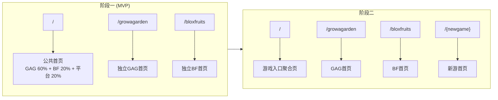

# 新游拓展专项 PRD

## 一、需求背景

### 1.1 项目现状
网站当前主要服务 **Grow a Garden** 游戏玩家，提供道具价值、道具 Wiki、交易价值计算器、文章内容、宠物管理等功能。

### 1.2 扩展计划
随着用户搜索需求与扩展计划，我们计划支持第二款 Roblox 游戏 **Blox Fruits**。

> **Blox Fruits** 是一款基于《海贼王》灵感制作的 Roblox 动作冒险游戏，玩家通过获取和使用各种"果实"获得特殊能力，在开放世界中刷怪升级、打 Boss、PvP 对战并探索多个海域，是 Roblox 上人气最高、玩法最丰富的刷级与战斗类游戏之一。
> 
> 游戏链接：https://www.roblox.com/games/2753915549/Blox-Fruits#!/about

### 1.3 需求目标

1. 支持 Blox Fruits 可交易道具的价值展示、Wiki 信息、交易系统、列表功能、文章内容等功能
2. 在不破坏现有 GAG 功能的前提下，新增一套独立的 Blox Fruits 功能区域
3. 形成多游戏架构的基础，为未来扩展第 3 款或更多游戏打下基础
4. 能抽象成配置或组件的，尽量抽象，以便后续更快速的增加新游戏

---

## 二、基础框架设计

### 2.1 首页分阶段渐进式改版

根据游戏数量的增长，首页架构分两个阶段逐步演进：

#### 阶段一：双游戏公共首页（MVP）

> **调整说明（2025-12-25）：** 原阶段一（GAG为主+BF软入口）与阶段二（双游戏公共首页）合并，MVP上线时直接采用公共首页+独立游戏首页的架构，不再做302重定向过渡。

| 维度 | 说明 |
|------|------|
| **基础条件** | BF基础页面完成 |
| **`/` 首页** | 公共首页：GAG模块(60%) + BF模块(20%) + 平台品牌介绍(20%) |
| **`/growagarden`** | 独立GAG首页（基于目前首页改版） |
| **`/bloxfruits`** | 独立BF首页，新建；页面结构复用GAG首页 |
| **SEO重心** | `/` 目标多游戏品牌词；各游戏首页聚焦各自关键词 |

```
用户访问 / → 公共首页（GAG 60% + BF 20% + 平台介绍 20%）
用户访问 /growagarden → 独立GAG首页
用户访问 /bloxfruits → 独立BF首页
```

**预期效果：**
- `/` 和 `/growagarden` 两个URL都独立被Google索引
- 总的搜索流量增加
- 架构清晰，便于后续扩展

**可能的影响和应对方案：**


#### 阶段二：多游戏入口聚合（3款及以上）

| 维度 | 说明 |
|------|------|
| **条件** | 支持第3款游戏时 |
| **`/` 首页** | 纯游戏入口聚合页 + 平台品牌 |
| **各游戏首页** | `/growagarden`、`/bloxfruits`、`/{newgame}` 各自独立 |
| **SEO重心** | `/` 聚焦平台品牌 + 通用"Roblox trading"关键词 |



### 2.2 URL结构规范

| 类型 | URL结构 | 示例 |
|------|---------|------|
| 游戏首页 | `/{gameKey}` | `/growagarden`、`/bloxfruits` |
| 道具Value列表 | `/{gameKey}/value` | `/growagarden/value` |
| Wiki列表 | `/{gameKey}/wiki` | `/bloxfruits/wiki` |
| 道具wiki详情 | `/{gameKey}/wiki/{道具名称id}` | `/bloxfruits/wiki/dragon-fruit` |
| 交易列表 | `/{gameKey}/tradelist` | `/growagarden/tradelist` |
| 创建交易 | `/{gameKey}/trade/create` | `/bloxfruits/trade/create` |
| 价值计算器 | `/{gameKey}/tradecalculator` | `/growagarden/tradecalculator` |
| Tier List | `/{gameKey}/{道具类型}-tierlist` | `/growagarden/pets-tierlist`、`/bloxfruits/fruits-tierlist` |

### 2.3 公共页面URL

| 类型 | 新URL结构 | 说明 |
|------|---------|------|
| 公共首页 | `/` | 覆盖多款游戏的介绍和入口 |
| 聊天页 | `/chat` | （URL路径需修改）所有游戏共用，通过Tab筛选游戏（详见4.8） |
| 用户主页 | `/user/{用户uid}` | 所有游戏共用一个用户中心页 |
| 个人设置 | `/settings` | 所有游戏共用一个用户中心设置页 |
| giveaway列表页 | `/giveaways` | （URL路径需修改）公共抽奖聚合页，所有游戏共用（详见4.4） |
| giveaway详情页 | `/giveaways/{抽奖标题}` | （URL路径需修改）抽奖详情页（已有收录，URL规则需讨论-是否需要增加gamekey一级区分游戏？） |
| 新手指引 | `beginners-guide` | （URL路径需修改）公共页面，页面内容需更新，强调站点交易流程 |
| 安全交易 | `/safe-trading-guide` | （URL路径需修改）公共页面，页面内容需更新，强调站点交易中通用性风险防范 |
| 更新日志 | `/updatelog` | （URL路径需修改）公共页面，通过管理端配置游戏层级，前端UI区分各游戏（详见4.3） |
| FAQ | `/faq` | （URL路径需修改）公共页面，站点通用FAQ |
| 贡献者页 | `/contributors` | （URL路径需修改）公共页面，所有游戏合作者都可以展示，内容需更新 |
| 关于我们 | `/about-us` | 公共页面，内容需更新 |
| 隐私政策 | `/privacy-policy` | 公共页面 |
| 用户协议 | `/user-agreement` | 公共页面 |
| cookie政策 | `/cookie-policy` | 公共页面 |


### 2.4 SEO策略（整体占位，待细化）

#### 2.4.1 TDK优化策略

| 阶段 | 页面 | Title | Meta Description |
|------|------|-------|------------------|
| 阶段一 | `/` | _待页面设计完成后补充_ | _待补充_ |
| 阶段一 | `/growagarden` | _待补充_ | _待补充_ |
| 阶段一 | `/bloxfruits` | _待补充_ | _待补充_ |
| 阶段二 | `/` | _待补充_ | _待补充_ |

#### 2.4.2 Heading结构规范

| 阶段 | 页面 | H1 | H2建议 |
|------|------|------|--------|
| 阶段一 | `/` | _待补充_ | _待补充_ |
| 阶段一 | `/growagarden` | _待补充_ | _待补充_ |
| 阶段一 | `/bloxfruits` | _待补充_ | _待补充_ |

#### 2.4.3 结构化数据 (Schema)

| 类型 | 适用范围 | 说明 |
|------|----------|------|
| `Organization` | 全站 | 平台品牌信息 |
| `WebSite` | `/` | 含SearchAction |
| `VideoGame` | 各游戏首页 | 游戏基础信息 |
| `BreadcrumbList` | 所有页面 | 面包屑导航 |
| `FAQPage` | FAQ相关页面 | 常见问题 |
| `Article` | 文章页面 | 文章内容 |

> **注：** 具体Schema内容待页面设计完成后细化

#### 2.4.4 Canonical标签策略

| 阶段 | URL | Canonical指向 |
|------|-----|---------------|
| 阶段一 | `/` | `https://域名/` |
| 阶段一 | `/growagarden` | `https://域名/growagarden` |
| 阶段一 | `/bloxfruits` | `https://域名/bloxfruits` |
| 阶段二 | `/` | `https://域名/` |

#### 2.4.5 Sitemap策略

**阶段一（MVP）：**
- 主sitemap `/sitemap.xml` 包含 `/`、`/growagarden`、`/bloxfruits`
- 各游戏独立sitemap：
  - `/growagarden/sitemap.xml`
  - `/bloxfruits/sitemap.xml`
- 主sitemap引用各子sitemap

**阶段二起：**
- 新增游戏时添加对应sitemap
- 主sitemap引用所有子sitemap

#### 2.4.6 内链权重传递

| 阶段 | 策略 |
|------|------|
| 阶段一 | 公共首页双向内链：GAG模块 ↔ `/growagarden`，BF模块 ↔ `/bloxfruits` |
| 阶段二 | 聚合页提供各游戏首页入口，各游戏首页互相交叉链接 |

#### 2.4.7 301重定向说明

| 类型 | 用途 | SEO影响 |
|------|------|---------|
| **301永久重定向** | 仅用于URL结构变更时的旧URL处理 | 传递约90%权重到新URL |

> **注（2025-12-25更新）：** MVP阶段不再使用302临时重定向，`/` 和 `/growagarden` 从一开始就是独立页面。

---

## 三、MVP阶段需求清单（PM: 雪竹）

### 3.1 页面模块

| 序号 | 页面模块 | 优先级 | 规划点 | 是否抽象为配置 | 是否需要按游戏区分 | GAG页面URL | BF页面URL | 后续新游URL模板 | 说明 |
|------|----------|--------|--------|----------------|-------------------|-------------|-----------|-----------------|------|
| 1 | 导航栏 | P0(MVP) | 默认与单游戏切换的逻辑，一、二级入口 | ✅ 是 | 是 | 独立导航栏 | 独立导航栏 | 独立导航栏 | 公共页面(如首页、关于我们、隐私政策等)单独一套导航栏，给出每款游戏的入口 |
| 2 | footer | P0(MVP) | 默认与单游戏切换的逻辑 | ✅ 是 | 是 | 独立footer | 独立footer | 独立footer | 公共页面单独一套footer，给出每款游戏的入口 |
| 3 | 公共首页 | P0(MVP) | 新增 | ❌ 否 | 否 | — | — | — | 公共首页需要改版，覆盖多款游戏的介绍和入口 |
| 4 | 单游戏首页 | P0(MVP) | 原首页中GAG的内容要保留，给新游首页先提供入口 | — | 是 | /growagarden | /bloxfruits | /{新游名称} | — |
| 5 | 用户主页 | P0(MVP) | 默认与单游戏切换的逻辑 | ❌ 否 | 否 | /user/{用户uid} | /user/{用户uid} | /user/{用户uid} | 所有游戏共用一个用户中心页，页面增加一级游戏筛选 |
| 6 | 个人中心设置页 | P0(MVP) | 隐私设置中增加新游内容tab的隐私设置 | ❌ 否 | 否 | /settings | /settings | /settings | 所有游戏共用一个用户中心设置页 |
| 7 | 聊天页面 | P0(MVP) | 公共聊天页，顶部Tab筛选游戏（详见4.7） | ❌ 否 | 否 | /chat | /chat | /chat | 所有游戏共用一个聊天页，通过Tab筛选（All/GAG/BF） |
| 8 | 订单列表页 | P0(MVP) | 订单列表组件样式更新：格子数量、WFL提示变化（是否能抽象为可配置） | ⏳ 待定 | 是 | /growagarden/tradelist | /bloxfruits/tradelist | /{新游名称}/tradelist | — |
| 9 | 订单详情页 | P0(MVP) | 内容模块更新；订单主逻辑是否有调整？ | ⏳ 待定 | 是 | /growagarden/tradelist/{订单id} | /bloxfruits/tradelist/{订单id} | /{新游名称}/tradelist/{订单id} | — |
| 10 | 创建交易页 | P0(MVP) | 主要变更：WFL差值限制，gap>40%不能提交 | ⏳ 待定 | 是 | /growagarden/trade/create | /bloxfruits/trade/create | /{新游名称}/trade/create | — |

### 3.2 公共组件

| 序号 | 组件名称 | 优先级 | 规划点 | 待讨论事项 |
|------|----------|--------|--------|------------|
| 1 | 组件-订单列表 | P0(MVP) | UI/UX复用；根据新游戏的关键数据字段设计 | 需确认BF道具展示的关键字段 |
| 2 | 组件-道具信息卡片 | P0(MVP) | UI/UX复用；根据新游戏的关键数据字段设计 | 需确认BF道具展示的关键字段 |
| 3 | 组件-道具交易信息卡片 | P0(MVP) | UI/UX复用；根据新游戏的关键数据字段设计 | 需确认BF道具展示的关键字段 |
| 4 | 组件-道具交易信息弹窗 | P0(MVP) | UI/UX复用；根据新游戏的关键数据字段设计 | 需确认BF道具展示的关键字段 |
| 5 | 组件-道具选择弹窗 | P0(MVP) | UI/UX复用；根据新游戏的关键数据字段设计 | 需确认BF道具展示的关键字段、格子数量(BF最多4个) |
| 6 | 组件-道具参数设置弹窗 | P0(MVP) | UI/UX复用；根据新游戏的关键数据字段设计 | 需确认BF道具的可配置参数 |

参考道具信息数据表：https://doc.weixin.qq.com/sheet/e3_ATMA6AazAK0CNDxQbNrIgRpuvF2SZ?scode=AFIANgeJAA0i560aV5AWkAuwbIADo&tab=BB08J2

---

## 四、各页面模块需求细节

> 以下需求待逐一细化

### 4.1 导航栏（需求方案、视觉已定稿）
视觉：(https://www.figma.com/design/4mDwVh4lJ2t1Yy7EcINY5t/UI-Kit?node-id=5347-868&p=f&t=7Ba3lDA23mkxLYwZ-0)

#### 4.1.1 总体原则

- 每个游戏有**独立的游戏导航栏+footer**，随着页面路径 `/{gameKey}/` 切换
- 公共页面有**一套独立的公共导航栏+footer**
- 整体视觉风格会根据游戏来区分（如导航栏、banner、主色调）
- UI公共组件尽可能复用


新功能：**游戏选择器**
游戏选择器位于导航栏左侧Logo旁，用于在不同游戏之间切换，是多游戏平台的核心导航组件。

**视觉结构：**
- **游戏图标**：当前选中游戏的Logo
- **游戏名称**：当前选中游戏的名称（如"Grow A Garden"、"Blox Fruits"），使用品牌色高亮
- **副标题文案**：根据状态动态变化（见下方）
- **下拉箭头**：指示可展开状态

**副标题文案状态区分：**

| 状态 | 副标题文案 | 说明 |
|------|-----------|------|
| **默认状态**（非Hover/非点击） | `Current Game` | 明确告诉用户当前游戏 |
| **Hover / 点击状态**（下拉菜单出现时） | `Select Game` | 提示用户可以进行选择操作 |

**下拉菜单交互：**
- Hover或点击触发下拉菜单展开
- 下拉菜单展示所有可用游戏列表，每项包含游戏图标+游戏名称
- 当前选中的游戏显示选中态（如✓图标和高亮背景）
- 点击其他游戏项后，跳转至对应游戏首页 `/{gameKey}`
- 点击选择器外部或按ESC键关闭下拉菜单


##### P1需求：**支持导航栏可配置**
为支持新游快速上线，减少后续开发工作量，并根据各游戏新增页面灵活调整导航的入口，将游戏导航栏抽象为管理端配置，无需每次调整都发版。
（因公共导航栏后续还将改版，因此初期配置主要针对游戏导航栏而非公共导航栏）


**游戏导航栏-菜单可配置项**：
- 游戏选择器：上传游戏logo、填写游戏名称，自动展示选择器入口
- 一级菜单入口图标：支持上传图片or SVG文件（待确认方案）
- 一级菜单入口文案：输入框 （需限制最大字符数）
- 是否有下拉菜单：有下拉菜单则该入口本身无跳转落地页，只作为一个功能类型收纳其下的二级入口。勾选后则展开二级菜单配置项（下拉菜单中每个入口的图标+文案+链接与上面一级入口一致）；二级入口至少需要>1个才可选择为下拉菜单，否则只能作为一级入口
- 一级入口跳转链接：输入框填写落地页URL（如有下拉菜单，则该一级入口不必填写链接）
- New角标：可勾选
- 移动端是否展开：勾选后则该一级菜单项下的二级入口在中下屏时默认为展开状态，支持用户手动折叠
- Discord入口链接：配置不同游戏对应的Discord频道邀请页的URL
- 极限展示情况（待设计侧确认规范）

导航栏上其他元素的样式与逻辑则为通用：
- 品牌logo：所有导航栏通用，点击则跳转站点公共首页
- 消息、登录、用户头像：通用逻辑，详见后续"4.1.4 用户区交互规范"部分

**预览功能**：配置导航栏后支持在管理端预览前端实际效果，如没有问题才可确认生效。确认按钮需二次提醒，以防误操作。


#### 4.1.2 游戏导航栏

游戏导航栏在用户访问对应游戏`/{gameKey}`及 `/{gameKey}/xxx` 路径时展示，菜单项根据当前游戏动态显示其可用功能。


| 元素 | 说明 |
|------|------|
| **游戏Logo**（待定） | 点击回到访游戏首页 `/{gameKey}` |
| **游戏切换器** | 展示选中状态的游戏，点击下拉选择其他游戏，切换后跳转对应游戏首页`/{gameKey}` |
| **公共入口** | Giveaways等公共页面入口，位置可以插在功能入口之间 |
| **功能菜单** | 根据游戏可用功能动态显示不同入口（如Trade、Value、Wiki、Calculator等） |
| **社区入口** | 根据游戏展示对应的discord入口，引导用户关注（公共导航栏不展示该入口）|
| **用户区** | MESSAGE按钮（Chat页面）、用户头像/登录按钮 |

- **BF MVP阶段可用菜单：** Trade（一级 Trade，二级 Tradeable Items、Trade Listing、Post a Trade）、Trade Calculator、Wiki（一级 Wiki，二级 Fruit Wiki、Fruit Tier List）
- **GAG已完整菜单：** 现有入口不变，如Trade、Value、Wiki、Calculator、Articles、Pets等


#### 4.1.3 公共导航栏

公共导航栏在用户访问公共页面（如 `/`、`/chat`、`/user/{uid}`、`/settings`）时展示。

##### 结论：**优先考虑GAG老用户体验 + 快速上线**，MVP阶段使用**方案一**
可以理解为MVP阶段时，公共导航栏可复用GAG导航栏展示的入口和交互逻辑；但在未来阶段二多个游戏上线后，不强调GAG单游戏时，公共导航栏将改版使用下面方案二模式。
需注意：**即使MVP时公共导航栏与GAG导航栏一样，但两者本质上是2套导航栏，需避免使用上的混淆。**

##### 方案对比表

| 维度 | 方案一：**GAG优先模式** | 方案二：纯公共入口模式（参考Gamesberg） |
|------|---------------------|----------------------------------------|
| **核心思路** | 公共导航栏默认展示GAG菜单入口，同时提供游戏切换器 | 公共导航栏只展示游戏选择和公共功能入口，不默认展示任何游戏菜单 |
| **TradeKitsune Logo** | 平台Logo，点击回到 `/` | 平台Logo，点击回到 `/` |
| **游戏切换器** | 下拉菜单，含"Grow a Garden ⭐"、"Blox Fruits"，GAG标记为默认 | 大型Mega Menu，分栏展示：Games / Giveaways / Community |
| **功能菜单** | 默认优先显示GAG的完整菜单（Trade、Value、Wiki等），切换游戏后菜单对应变化 | 不显示游戏功能菜单，功能入口需要先选择游戏 |

##### 优劣对比分析

| 维度 | 方案一：GAG优先模式 | 方案二：纯公共入口模式 |
|------|---------------------|----------------------|
| **GAG用户体验** | ✅ 极佳：公共页面仍可一键进入GAG功能，无需额外点击 | ⚠️ 需多一步：需先选择游戏才能进入功能页 |
| **BF用户体验** | ⚠️ 一般：需要切换游戏才能看到BF入口，且BF菜单项较少 | ✅ 公平：所有游戏平等展示，无主次之分 |
| **新游戏扩展** | ⚠️ 需调整：添加第3款游戏时需重新考虑默认游戏策略 | ✅ 天然支持：直接在Games栏添加新游戏即可 |
| **开发复杂度** | ✅ 低：复用游戏导航栏逻辑，仅增加默认游戏配置 | ⚠️ 中：需设计Mega Menu组件，布局更复杂 |
| **信息密度** | ✅ 高：一屏展示更多功能入口 | ⚠️ 低：需展开菜单才能看到选项 |
| **视觉一致性** | ⚠️ 公共页面与GAG页面导航栏几乎一样，可能造成混淆 | ✅ 公共页面有明确的"平台级"视觉差异 |
| **阶段兼容性** | ✅ 阶段一适合（GAG为主）；阶段二三需调整 | ✅ 全阶段适用，无需大改 |
| **用户认知负担** | ✅ 低：老用户几乎无感知变化 | ⚠️ 中：需要理解"先选游戏再选功能"的模式 |


#### 4.1.4 用户区交互规范

导航栏用户区包含**MESSAGE按钮**和**用户头像/登录按钮**，沿用**强消息曝光**策略。

##### 消息入口（MESSAGE按钮）

| 用户状态 | 视觉表现 | 点击行为 |
|----------|----------|----------|
| **未登录** | 隐藏入口 | -- |
| **已登录 - 无未读** | `[💬 MESSAGE]` 正常颜色 | 跳转聊天页（见下方场景区分） |
| **已登录 - 有未读** | `[💬 MESSAGE ⓳]` 带红色未读消息数量 | 跳转聊天页（见下方场景区分） |

现网逻辑不变，**调整点**（作为P1功能）：未读消息数量根据导航栏/页面区分，即公共页面/公共导航栏时，则展示所有的未读消息合计；如在单游戏页面/游戏导航栏中，则展示该游戏的未读消息数。**MVP阶段则无需区分游戏展示分别的未读消息数。**

##### 用户头像/登录按钮

| 用户状态 | 视觉表现 | 交互行为 |
|----------|----------|----------|
| **未登录** | `[Login]` 按钮 | 点击跳转登录页 |
| **已登录 - 大屏** | `[👤 用户头像]` | 点击：跳转个人中心（见下方场景区分）；Hover：显示下拉菜单 |
| **已登录 - 中小屏** | `[👤 用户头像]` | 点击：跳转个人中心（见下方场景区分，无hover下拉） |

##### 用户区场景区分逻辑

> **核心规则：** 用户区入口的跳转行为需要根据当前所在页面类型（公共页面 vs 游戏页面）区分，以保持用户上下文的一致性。
可以理解为，游戏页面中游戏导航栏用户区的跳转都应该对应到该游戏的数据展示。

**设计目的：**
- 用户在某游戏场景下点击入口，保持同一游戏上下文，避免跳出感
- 公共页面保持中立状态，不预设任何游戏筛选

示例说明：
| 当前页面类型 | 页面示例 | MESSAGE按钮跳转 | 用户头像跳转 |
|--------------|----------|-----------------|--------------|
| **公共页面** | `/`、`/chat`、`/user/{uid}`、`/settings`、`/giveaways`、`/updatelog` | `/chat`（默认All标签） | `/user/{uid}`（默认展示，无游戏筛选） |
| **GAG游戏页面** | `/growagarden`、`/growagarden/tradelist`、`/growagarden/value`等 | `/chat?tab=gag`（筛选GAG消息） | `/user/{uid}?game=gag`（展示GAG相关数据） |
| **BF游戏页面** | `/bloxfruits`、`/bloxfruits/tradelist`、`/bloxfruits/value`等 | `/chat?tab=bf`（筛选BF消息） | `/user/{uid}?game=bf`（展示BF相关数据） |


##### 其他需兼容场景区分逻辑的地方

> 以下场景也应遵循相同的"上下文保持"原则：

| 场景 | 说明 | 兼容方案 |
|------|------|----------|
| **订单确认后跳转聊天** | 用户在订单详情页确认交易后，需跳转与对方的1v1聊天 | 携带订单所属游戏参数，聊天页显示对应游戏角标 |
(未全部枚举，如有遗漏待讨论）

##### 用户头像Hover下拉菜单（仅大屏）


| 菜单项 | 说明 |
|--------|------|
| Personal Center | 跳转当前用户的个人主页（见上方场景区分，/user/{uid} 或 /user/{uid}?game=xxx） |
| Post a Trade | 快捷发布交易，跳转创建交易页（根据游戏自动区分，跳转 /growagarden/trade/create 或/bloxfruits/trade/create） |
| My Pets  | 展示与交互逻辑与现网一致，但增加游戏判断，即该入口仅在GAG的情况下展示 |
| Log Out | 退出登录，清除会话 |
> **注：** 原有的"My Pets"入口移除


#### 4.1.5 中小屏导航栏

##### 整体布局

| 元素 | 说明 |
|------|------|
| **汉堡菜单** | 点击展开侧边抽屉 |
| **网站Logo** | 与大屏相同 |
| **游戏选择器** |样式简化  |
| **用户区** | 消息、登录/用户头像逻辑同现网 |

##### 汉堡菜单展开内容（左侧边抽屉）


###### 菜单内容
**游戏导航栏中Discord入口**：文案通用，但游戏logo和跳转链接页跟着对应游戏走(和大屏时一样)


#### 4.1.6 导航栏滚动交互优化（本节自MVP中移除，先不开发）
12/29更新：本期不增加该交互优化，待后续上线再定

> 当前导航栏固定顶部，占用较多视野空间。采用行业通用的**滚动隐藏/显示**方案优化用户有效视野。

##### 交互逻辑（以下为示例，具体实现由研发与视觉确认）

| 用户行为 | 导航栏状态 | 说明 |
|----------|------------|------|
| **页面加载** | 显示 | 初始状态正常展示导航栏 |
| **向下滚动** | 隐藏 | 滚动超过阈值（如50px）后，导航栏向上滑出隐藏 |
| **向上滚动** | 显示 | 任意向上滚动即触发导航栏滑入显示 |
| **滚动到顶部** | 显示 | 页面滚动到最顶部时，导航栏始终显示 |
| **悬停在导航栏区域** | 保持显示 | 鼠标悬停在导航栏上时不隐藏（大屏） |

##### 动画规范（以下为示例，具体实现由研发与视觉确认）

| 维度 | 规范 |
|------|------|
| **过渡动画** | `transform: translateY()` + `transition: 0.3s ease-out` |
| **隐藏方式** | 向上平移（translateY(-100%)），保留DOM占位避免页面跳动 |
| **触发阈值** | 向下滚动 > 50px 触发隐藏；向上滚动任意距离触发显示 |
| **节流处理** | 滚动事件节流（如100ms），避免频繁触发 |

##### 大小屏适配（供参考）

| 屏幕 | 特殊处理 |
|------|----------|
| **大屏** | 导航栏隐藏后释放视野 |
| **中小屏** | 导航栏高度约48-56px，隐藏逻辑一致 |
| **触摸设备** | 支持触摸滚动方向检测，逻辑同上 |

**行业参考**
- Twitter/X：向下滚动隐藏，向上滚动显示
- Medium：类似交互，阅读体验优先
- Gamesberg：导航栏固定但高度较小


### 4.2 Footer（需求方案、视觉已定稿）
视觉稿：https://www.figma.com/design/4mDwVh4lJ2t1Yy7EcINY5t/UI-Kit?node-id=5409-4552&p=f&t=7Ba3lDA23mkxLYwZ-0

#### 4.2.1 通用Footer设计

> 考虑到BF内容在MVP阶段相对较少，采用**通用Footer**方案，同时展示GAG资源、BF资源和公共页面入口，避免区分多套Footer增加工作量。

##### Footer布局结构


##### Footer内容分区

| 分区 | 内容 | 说明 |
|------|------|------|
| **品牌区** | Logo、Slogan、社交媒体图标（保留X/YouTube，移除Discord） | 左侧，品牌展示文案"Your trusted Roblox games trading hub. 
Trade smarter with a secure marketplace for Grow a Garden, Blox Fruits, and expanding to more roblox games." |
| **Grow a Garden** | Trade、Trade Calculator、Pet Value、Pet Wiki、Event Wiki、Guides、Pet Management | GAG游戏功能入口 |
| **Blox Fruits** | Trade、Trade Calculator、Fruit Wiki、Fruit Tier List | BF游戏功能入口（MVP阶段内容较少） |
| **HELP** | Beginner's Guide、Safe Trading Guide、Updatelog、FAQ、Feedback | 帮助与支持 |
| **LEGAL** | Contributors、About Us、Privacy Policy、User Agreement、Cookie Policy | 法律与关于 |
| **Truspilot入口** | 现网逻辑不变，增加评分、评论数量展示 | TR评价引导 |
| **版权声明** | 免责声明 + 版权信息 | 底部，居中展示 |

##### 链接映射表

| 分区 | 链接项 | 目标URL |
|------|--------|---------|
| **GAG RESOURCES** | Trade | `/growagarden/tradelist` |
| | Trade Calculator | `/growagarden/calculator` |
| | Giveaways | `/giveaways` |
| | Pet Value | `/growagarden/value` |
| | Pet Wiki | `/growagarden/wiki` |
| | GAG Guides | `/growagarden/guides` |
| | Pet Management | `/growagarden/pet-management` |
| **BF RESOURCES** | Trade | `/bloxfruits/tradelist` |
| | Trade Calculator | `/bloxfruits/calculator` |
| | Fruit Wiki | `/bloxfruits/wiki` |
| | Fruit Tier List | `/bloxfruits/fruits-tierlist` |
| **HELP** | Beginner's Guide | `/beginners-guide` |
| | Safe Trading Guide | `/safe-trading-guide` |
| | Updatelog | `/updatelog` |
| | FAQ | `/faq` |
| | Feedback | `不变，tally (外部链接) |
| **LEGAL** | Contributors | `/contributors` |
| | About Us | `/about-us` |
| | Privacy Policy | `/privacy-policy` |
| | User Agreement | `/user-agreement` |
| | Cookie Policy | `/cookie-policy` |

##### 响应式布局（供参考，以视觉稿为准）

| 屏幕 | 布局 |
|------|------|
| **大屏** | 5栏横向布局：品牌区 + GAG + BF + HELP + LEGAL |
| **中屏** | 3栏布局：品牌区独占一行，下方 GAG+BF / HELP+LEGAL 分两行 |
| **小屏** | 单栏纵向布局：各分区依次垂直排列 |

---

### 4.3 Updatelog更新日志页

> **调整说明（2025-12-25）：** updatelog从分游戏页面（`/{gameKey}/updatelog`）改为公共页面（`/updatelog`）

#### 4.3.1 页面定位

| 维度 | 说明 |
|------|------|
| **URL** | `/updatelog` |
| **页面类型** | 公共页面 |
| **导航栏** | 公共导航栏 |
| **主要功能** | 展示平台更新日志，包含所有游戏的更新内容 |

#### 4.3.2 内容管理

| 维度 | 说明 |
|------|------|
| **管理端配置** | 新增"游戏"选择字段，支持选择：全平台/GAG/BF/... |
| **数据结构** | 每条更新日志包含：标题、内容、发布时间、游戏归属 |
| **游戏归属** | `all`（全平台）、`gag`、`bf`、后续扩展新游戏 |

#### 4.3.3 前端展示

| 维度 | 说明 |
|------|------|
| **筛选方式** | 顶部Tab或下拉筛选：All / GAG / BF |
| **游戏标识** | 每条更新日志旁显示游戏角标/标签 |
| **排序** | 按发布时间倒序 |
| **分页** | 支持加载更多或分页 |

```
┌──────────────────────────────────────────────────────────────────┐
│  Updatelog                                                       │
│  ─────────────────────────────────────────────────────────────── │
│  [All] [Grow a Garden] [Blox Fruits]  ← Tab筛选                  │
│  ─────────────────────────────────────────────────────────────── │
│  📅 2025-01-15  [GAG]                                            │
│  New Pet: Golden Dragon Released!                                │
│  We've added a new legendary pet...                              │
│  ─────────────────────────────────────────────────────────────── │
│  📅 2025-01-10  [Platform]                                       │
│  Trade Calculator Improvements                                   │
│  Enhanced accuracy for value calculations...                     │
│  ─────────────────────────────────────────────────────────────── │
│  📅 2025-01-05  [BF]                                             │
│  Blox Fruits Trading Now Available!                              │
│  Start trading your fruits today...                              │
└──────────────────────────────────────────────────────────────────┘
```
---

### 4.4 Giveaway抽奖页（P1改造）

> **调整说明（2025-12-25）：** giveaway从分游戏页面改为公共页面

#### 4.4.1 Giveaway列表页（聚合页）

| 维度 | 说明 |
|------|------|
| **URL** | `/giveaways` |
| **页面类型** | 公共页面 |
| **导航栏** | 公共导航栏 |
| **主要功能** | 展示所有游戏的抽奖活动列表 |

**筛选与展示：**
- 顶部Tab或下拉筛选：All / GAG / BF
- 每个抽奖卡片显示游戏角标
- 支持按状态筛选：进行中/已结束

#### 4.4.2 Giveaway详情页

| 维度 | 说明 |
|------|------|
| **URL** | `/giveaways/{抽奖标题}` |
| **页面类型** | 公共页面 |
| **导航栏** | 公共导航栏 |

> **⚠️ URL规则待前置讨论：**
> - 现有结构：`/growagarden/giveaways/{抽奖标题}` 已被Google收录
> - 新结构：`/giveaways/{抽奖标题}`
> - 需要讨论：是否需要301重定向？如何处理已收录URL？

#### 4.4.3 游戏标识规则

| 场景 | 游戏标识展示 |
|------|--------------|
| 抽奖卡片（列表页） | 显示游戏角标（GAG/BF图标） |
| 抽奖详情页 | 页面标题区域显示游戏归属 |
| 奖品道具 | 道具卡片显示所属游戏 |

---

### 4.5 公共首页（MVP，方案待细化）

> **调整说明（2025-12-25）：** MVP直接采用公共首页架构，内容比例为GAG(60%) + BF(20%) + 平台品牌(20%)

#### 4.5.1 模块布局（从上到下）

| 模块位置 | 模块名称 | 内容说明 | 是否新增 |
|----------|----------|----------|----------|
| 1 | Hero区 | 平台品牌展示，统计数据动态化（全平台数据） | 微调 |
| 2 | 游戏切换卡片 | GAG/BF双卡片入口 | ✅ 新增 |
| 3 | GAG热门交易道具 | GAG热门道具列表（约60%占比） | 保留 |
| 4 | GAG最新订单列表 | GAG最新订单 | 保留 |
| 5 | BF入口模块 | BF游戏介绍 + 快捷入口（约20%占比） | ✅ 新增 |
| 6 | Toolbox工具箱 | 展示各游戏可用工具入口 | 更新 |
| 7 | 平台介绍Banner | 平台品牌介绍（约20%占比） | ✅ 新增 |
| 8 | 广告位 | Google AdSense自动填充，不干预 | 不变 |
| 9 | Footer | 公共Footer | 见4.2 |

#### 4.5.2 新增模块设计

**游戏切换卡片（Hero下方）**
- 双卡片并排：Grow a Garden / Blox Fruits
- 卡片内容：游戏Logo + 名称 + 简短描述 + "Enter"按钮
- 点击卡片跳转至对应游戏首页

**BF入口模块**
- 横幅样式，突出展示
- 左侧：BF游戏Logo + 标题"Trade Blox Fruits Items"
- 右侧："Start Trading →"按钮
- 点击跳转至 `/bloxfruits`

**平台介绍Banner（Footer上方）**
- 简洁设计
- 内容：平台名称 + 一句话定位（如"Your trusted Roblox trading platform"）
- 展示支持的游戏图标列表

---

### 4.6 单游戏首页（MVP，方案待细化）

#### 4.6.1 GAG首页

> URL: `/growagarden`

以目前首页为基础进行改版：

| 模块位置 | 模块名称 | 内容说明 | 是否新增/调整 |
|----------|----------|----------|---------------|
| 1 | 首屏Header | GAG主题设计，展示GAG交易统计数据 | 保留 |
| 2 | 运营Banner | 活动/公告等运营位 | 保留 |
| 3 | 游戏介绍 | GAG游戏简介 | ✅ 新增 |
| 4 | 可交易道具列表 | GAG热门道具 | 保留 |
| 5 | 订单列表 | GAG最新订单 | 保留 |
| 6 | 新版Toolbox | GAG可用工具（Value、Calculator、Wiki等） | ✅ 更新 |
| 7 | 文章模块 | GAG相关文章 | 保留 |
| 8 | 视频内容模块 | GAG相关视频（如有） | ✅ 新增（可选） |
| 9 | BF快捷入口区 | 横幅Banner引导用户进入BF首页 | ✅ 新增 |
| 10 | Footer | 公共Footer | 见4.2 |

#### 4.6.2 BF首页

> URL: `/bloxfruits`

| 模块位置 | 模块名称 | 内容说明 |
|----------|----------|----------|
| 1 | 首屏Header | BF主题设计，展示BF交易统计数据 |
| 2 | 运营Banner | 活动/公告等运营位 |
| 3 | 游戏介绍 | BF游戏简介 |
| 4 | 可交易道具列表 | BF热门道具列表 |
| 5 | 订单列表 | BF最新订单 |
| 6 | 新版Toolbox | BF可用工具（MVP阶段：Value List、Calculator、Wiki） |
| 7 | GAG快捷入口区 | 横幅Banner引导用户进入GAG首页 |
| 8 | 广告位 | Google AdSense自动填充 |
| 9 | Footer | 公共Footer |

**注意：BF的MVP阶段暂无文章、视频模块，待内容积累后再添加**

---

### 4.7 聊天页面（方案、视觉均已定稿）
说明：之前交易链路优化中聊天页的优化需求作废，以此版需求进行开发。
视觉稿：https://www.figma.com/design/oS9Yg9snhnkrTR3QF8f0Bf/chat?node-id=3240-5265&t=lLm1gQIizAA3mKYG-0

方案对比：


聊天页作为公共页面：
- [x] 聊天页采用公共路径 `/chat`，不分游戏
- [x] 通过顶部Tab实现游戏筛选（All/GAG/BF）
- [x] 用户私聊展示游戏角标
- [x] 系统通知区分公共与游戏相关，游戏相关则显示角标


#### 4.7.1 URL结构与路由
（以下URL为示例，以研发实际实现为准，主要目的为在同一页面上能通过tab切换实现便捷的展示所有与某游戏相关聊天）
| URL | 说明 |
|-----|------|
| `/chat` | 聊天页主路径，默认展示"All"标签 |
| `/chat?tab=gag` | GAG游戏相关会话 |
| `/chat?tab=bf` | BF游戏相关会话 |


#### 4.7.2 页面布局与Tab筛选


**顶部Tab栏**
- All：系统消息置顶+全部会话混排（默认）
- Grow a Garden：Grow a Garden 相关，不展示系统消息
- Blox Fruits：Blox Fruits 相关，不展示系统消息

**Tab交互逻辑**
- 切换Tab时更新URL参数 `?tab=xxx`
- 各Tab上显示未读消息数，如没有未读消息则不展示
- 无参数进入时默认显示"All"

#### 4.7.3 游戏角标标识

| 会话类型 | 角标规则 |
|----------|----------|
| 用户消息卡片（大屏左侧列表） | 展示所属游戏标签（文案为游戏名称），支持点击，点击后在**新页面**打开游戏首页 |
| 聊天窗口（大屏右侧聊天消息区） | 在交易信息卡片区域的首行右侧展示所属游戏标签（文案为游戏名称），支持点击，点击后在**新页面**打开游戏首页 |
| 系统通知-公共 | 如无游戏关联关系，则展示原来不同类型的默认图标 |
| 系统通知-游戏相关 | 左侧展示对应游戏图标 |


其他微调：用户聊天窗口中展示在线时间使用拼接逻辑（也复用在个人中心展示）"Days + Time",效果见视觉稿


#### 4.7.4 聊天窗口中交易信息卡片优化
- 将右侧view details改到左边用标题行跳转详情页，强化可点击效果，整行响应。标题行文案："View details of {订单号}"。
- 首行右侧为游戏标签，支持点击，点击后在**新页面**打开游戏首页
- 交易信息展示则复用BF的订单列表中卡片样式（在公共组件部分更新）
- **交互调整**：当前交易信息卡片为固定，占用较多视野空间，移动端消息可视区域太小。采用**滚动隐藏/显示**方案优化用户有效视野

交互逻辑（以下为示例，具体实现由研发与视觉确认）

| 用户行为 | 交易信息卡片卡片状态 | 说明 |
|----------|------------|------|
| **页面加载** | 显示 | 初始状态正常展示 |
| **向下滚动** | 隐藏 | 滚动超过阈值（如50px）后，向上滑出隐藏 |
| **向上滚动** | 显示 | 任意向上滚动即触发卡片滑入显示 |
| **滚动到顶部** | 显示 | 窗口滚动到最顶部时，卡片始终显示 |
| **悬停在卡片区域** | 保持显示 | 鼠标悬停在卡片上时不隐藏（大屏） |


#### 4.7.5 入口场景与默认行为

| 入口场景 | 跳转URL | 默认行为 |
|----------|---------|----------|
| 公共导航栏点击"MESSAGE" | `/chat` | 选中All标签 |
| GAG游戏导航栏点击"MESSAGE" | `/chat?tab=gag` | 选中GAG标签 |
| BF游戏导航栏点击"MESSAGE" | `/chat?tab=bf` | 选中BF标签 |
| 订单确认后自动跳转 | `??` | 直接打开与对方的1v1聊天 |
| (未来可拓展-开放私聊)用户主页点击"Send Message" | `/chat?conv={会话id}` | 直接打开与该用户的1v1聊天 |

#### 4.7.6 URL参数优先级
（待与研发讨论：是否有可能存在多个参数，如有则需确定优先级和处理方式）

---

### 4.8 订单列表页（GAG & BFd兼容）

> **定位**：Blox Fruits 订单列表页，可复用 GAG 订单列表页模板，进行游戏特定内容配置。  
> **参考**：`订单列表页-2025年11月更新.md`

#### 4.8.1 页面模板化设计建议

**通用不变模块**
| 模块 | 说明 |
|------|------|
| 页面布局结构 | Hero Banner + 搜索区 + 筛选区 + 订单信息卡片列表 + 分页 + FAQ + 底部工具入口 |
| 搜索框交互 | 搜索逻辑、placeholder 格式一致（详见5.1 组件-订单列表） |
| 筛选区结构 | 跟该游戏的公共组件走（详见5.1 组件-订单列表） |
| 订单卡片布局 | 卡片结构、交互逻辑由该游戏的订单列表组件决定（详见5.1 组件-订单列表）|
| 分页组件 | 整站使用统一组件，样式与交互一致 |


**需配置/灵活设置**
| 模块 | 配置项 | GAG 值 | BF 值 |
|------|--------|--------|-------|
| Hero Banner | 标题文案 | `Grow A Garden Trading - Browse Live GAG Trade List` | `Blox Fruits Trading - The Lattest Trade List` |
| Hero Banner | 副标题文案 | `Explore The Grow A Garden Trade List And Start GAG Trading Safely Today.` | `Browse the hottest trades from the Blox Fruits community. Trade safely and fast!` |
| Trading Guide | 跳转链接 | GAG 指南页 | BF 指南页（链接待补充） |
| 交易统计数据 | 显示文案（相同） | `Ongoing Trades` / `Completed Trades` | `Ongoing Trades` / `Completed Trades` |
| 交易统计数据 | 数据源 | GAG 交易数据 | BF 交易数据 |
| 主按钮 | 跳转链接 | GAG 创建交易页 | BF 创建交易页 |
| 工具文字链入口 | 工具1 | `GAG Pet Value` → Value 列表页 | `Blox Fruits Wiki` → Wiki 列表页 |
| 工具文字链入口 | 工具2 | `GAG Value Calculator` → 计算器页 | `Trade Calculator` → trade value计算器页 |
| FAQ | 内容 | GAG 相关 FAQ | BF 相关 FAQ（待运营提供） |
| 底部卡片工具入口 | 图标、文案、跳转链接（见下文） | GAG 相关内容 | BF 相关内容 |
| SEO | TDK | GAG 相关 | BF 相关 |


##### 4.8.2 底部工具入口卡片

**布局与交互**：3个工具入口卡片，横向排列；整个卡片响应点击

**工具卡片 1**：
```
图标：计算器图标
标题：Trade Value Calculator
描述：Calculate the value of your Blox Fruits trades
跳转：/bloxfruits/trade-calculator
```

**工具卡片 2**：
```
图标：Wiki 图标
标题：Blox Fruits Wiki
描述：Explore all fruits and gamepasses
跳转：/bloxfruits/wiki
```

**工具卡片 3**：
```
图标：榜单
标题：Blox Fruits Tier List
描述：View the rankings of all fruits
跳转：/bloxfruits/tier-list
```

##### 4.8.3 FAQ 模块

**状态**：内容待运营提供

**预留结构**：
```
Q: How do I trade in Blox Fruits?
A: [待补充]

Q: What determines fruit value?
A: [待补充]

Q: How do I know if a trade is fair?
A: [待补充]

Q: What are the different fruit rarities?
A: [待补充]
```

##### 4.8.4 SEO 配置
待细化


---

### 4.9 订单详情页（MVP，待规划）
- [ ] 订单主逻辑是否有调整？
- [ ] 内容模块有哪些更新？

---

### 4.10 创建交易页（MVP，待规划）
- [ ] WFL差值限制 gap>40% 的具体规则？
- [ ] 是否有其他业务规则差异？

---

### 4.11 用户主页（MVP，方案已确认）
视觉稿：https://www.figma.com/design/0M4JNzqICab4h3Vcewm8RZ/user?node-id=6426-22559&p=f&t=B8F0ft1uF8ns5eH0-0

> **2025-12-30 更新**：用户主页作为**公共页面**，使用**公共导航栏**，页面内游戏选择器定位为「数据筛选器」，不与导航栏联动。

#### 4.11.1 页面定位与导航栏关系

| 属性 | 说明 |
|------|------|
| 页面性质 | 公共页面 |
| 导航栏类型 | 公共导航栏（固定不变） |
| 游戏选择器性质 | 页面内「数据筛选器」，非全局上下文切换 |
| 与导航栏关系 | **无联动**，页面内切换游戏不影响导航栏状态 |

**设计理念**
- 用户主页的游戏选择器用于筛选展示「该用户在不同游戏中的数据」
- 与聊天页的Tab筛选逻辑一致：页面内筛选，不改变全局导航状态
- 保持公共页面框架的一致性和简洁性

#### 4.11.2 页面结构概览

| 区域 | 说明 | 是否调整 |
|------|------|----------|
| 用户基础信息区 | 头像、用户名、标签、注册时间、在线时间、统计数据等 | 不变 |
| Tab功能区 | 功能标签 + 游戏筛选器 | ✅ 调整 |
| Tab内容区 | 根据选中Tab和游戏筛选器展示对应内容 | ✅ 调整 |

#### 4.11.3 游戏筛选器设计


**位置与样式**
- 位于Tab行的**右侧**，与功能Tab保持同一水平线
- 采用**带前缀的下拉选择器**形式，明确其「筛选」而非「导航」的语义
**移动端适配**
- 宽度自适应，不超过屏幕宽度的60%
- 宽度较小时简化为图标形式示意，不用展示全部文案

**视觉示意**
```
┌────────────────────────────────────────────────────────────────────────────┐
│  [📦 Trades] [💬 Offers] [🎁 Giveaways] ...      Filter: [🌱 Grow a Garden ▼] │
│                                                                            │
│  ┌─────────────────────────────────────────────────────────────────────┐  │
│  │                          Tab内容区                                    │  │
│  │              （根据Tab + 游戏筛选器状态展示数据）                         │  │
│  └─────────────────────────────────────────────────────────────────────┘  │
└────────────────────────────────────────────────────────────────────────────┘
```

#### 4.11.4 交互逻辑
默认展示当前游戏，根据入口逻辑决定展示哪个游戏

**筛选器操作**
| 操作 | 行为 | 说明 |
|------|------|------|
| 点击/大屏hover筛选器 | 展开下拉菜单 | 显示所有可选游戏 |
| 选择游戏 | 切换筛选条件 | Tab内容区刷新为对应游戏数据 |
| 切换游戏 | URL参数更新 | `?game=x` ↔ `?game=y` |
| 切换游戏 | 导航栏状态 | **保持不变**（公共导航栏） |

**URL参数**
- 用户主页URL结构：`/user/{userId}?game={gameKey}`
- 仅作为页面内筛选状态，不影响全局导航

#### 4.11.5 场景示例

**场景1：从GAG订单详情页进入用户主页**
1. 用户在 `/growagarden/order/123` 查看GAG订单
2. 点击订单发布者头像，跳转至 `/user/xxx?game=gag`
3. 用户主页加载，游戏筛选器显示 `Filter: [🌱 Grow a Garden ▼]`
4. **导航栏保持为公共导航栏**（不受影响）
5. Tab内容展示该用户的GAG相关数据

**场景2：从BF Wiki页面进入用户主页**
1. 用户在 `/bloxfruits/wiki/dragon` 浏览BF道具
2. 点击自己的用户头像，跳转至 `/user/xxx?game=bf`
3. 用户主页加载，游戏筛选器显示 `Filter: [🍇 Blox Fruits ▼]`
4. **导航栏保持为公共导航栏**（不受影响）
5. Tab内容展示该用户的BF相关数据

**场景3：在用户主页内切换游戏筛选**
1. 当前在 `/user/xxx?game=gag`，查看该用户的GAG Trades
2. 点击筛选器，选择 `Blox Fruits`
3. URL更新为 `/user/xxx?game=bf`
4. **导航栏保持不变**（仍为公共导航栏）
5. Tab内容刷新为该用户的BF数据
6. 如当前Tab在BF中不可用，自动切换至第一个可用Tab

**场景4：从用户主页跳转至其他游戏页面**
1. 当前在 `/user/xxx?game=bf`，筛选器选中BF
2. 用户点击公共导航栏的 "Trade" 进入交易页
3. 因公共导航栏默认指向GAG，跳转至 `/growagarden/trade`
4. 符合预期：公共导航栏行为独立于页面内筛选器

#### 4.11.6 各游戏Tab结构

| Tab名称 | GAG | BF | 说明 |
|---------|-----|-----|------|
| Trades | ✅ | ✅ | 数据逻辑复用，BF使用BF的订单列表组件 |
| Offers | ✅(占位) | ✅(占位) | 首期均为占位，显示"Coming Soon" |
| Giveaways | ✅ | ❌ | BF暂不展示，待giveaway作为公共页面改版 |
| Favorites | ✅ | ✅ | GAG、BF首期均为占位 |
| Pet Collection | ✅ | ❌ | GAG专属功能，BF不展示 |

**BF首期Tab说明**
- **Trades**：数据查询逻辑复用GAG，订单列表展示使用BF专用的交易信息卡片组件（4格布局、BF特有样式等）
- **Offers**：首期为占位功能，Tab可点击，内容区展示"Coming Soon"提示。后续迭代时GAG与BF同步上线完整功能

#### 4.11.7 默认行为与边界处理

| 场景 | 处理方式 |
|------|----------|
| URL无game参数 | 默认筛选`gag` |
| URL game参数无效 | 降级筛选`gag` |
| 切换游戏后当前Tab不可用 | 自动切换至该游戏第一个可用Tab |
| 用户无该游戏该Tab数据 | 展示对应空状态提示 |
| 访问他人主页 | 筛选器正常可用，可查看对方不同游戏的公开数据 |

---

### 4.12 个人中心设置页
视觉稿：https://www.figma.com/design/0M4JNzqICab4h3Vcewm8RZ/user?node-id=5353-14038&t=B8F0ft1uF8ns5eH0-0

#### 4.12.1 页面定位

| 维度 | 说明 |
|------|------|
| **页面属性** | 公共页面，使用公共导航栏 |
| **设置范围** | 整站设置，不进行各游戏的单独控制 |
| **包含模块** | Privacy Settings（隐私设置）、Trading Time Preference（交易时间偏好，本次无调整） |

#### 4.12.2 Privacy Settings 模块
**核心定位**：
- 隐私设置为**全局设置**，一次设置对所有游戏生效
- 各Tab可见性控制是统一的开关，不区分游戏

**调整点**：由于不同游戏支持的Tab功能不同，需要在设置项中明确提示用户该设置适用于哪些游戏。MVP上线时，BF只有Trades和Offers、Favorites 3个tab。

#### 4.12.3 Privacy Settings 样式调整：添加游戏图标，直观展示该设置适用于哪些游戏。


---

## 五、公共组件（MVP）
视觉稿：https://www.figma.com/design/4mDwVh4lJ2t1Yy7EcINY5t/UI-Kit?node-id=5497-5322&p=f&t=sgCQGbMGqkoaYeZV-0

> **设计原则：** 由于不同游戏交易相关字段、交易限制等要求差异较大，整体组件采取"复用原有样式和交互逻辑 + 根据游戏差异调整"的策略，需重新开发而非直接套用原有组件配置。搜索、筛选、排序等基础功能逻辑可复用，具体字段根据新游戏定义。

### 5.1 组件-订单列表（方案已确认）
视觉稿：https://www.figma.com/design/4mDwVh4lJ2t1Yy7EcINY5t/UI-Kit?node-id=5497-5322&p=f&t=sgCQGbMGqkoaYeZV-0

由通用功能（搜索、筛选、排序）和交易信息卡片构成。

#### 5.1.1 交易信息卡片使用场景
包括订单列表页、首页订单模块、用户主页交易记录、聊天页、单个道具交易列表页-相似交易推荐模块等。

**游戏差异点**：
| 维度 | GAG | BF | 待确认事项 |
|------|-----|-----|----------|
| **格子数量** | 固定6个道具格子 | 固定4个格子 | ✅ 已确认 |
| **关键元素** | 有token；有稀有度角标；有数量角标；最后一格有"x more"逻辑 | 无token；稀有度以格子颜色区分，无角标；无数量角标；最后一格无"x more"逻辑；增加"Physical/Permanent"类型角标 | ✅ 已确认 |

**其他不变**：WFL提示、比例条、按钮等复用原有逻辑。


#### 5.1.2 通用功能（可复用）


红框处文案调整："pet" ->"item"

| 功能 | 说明 |
|------|------|
| **搜索** | 复用，支持按道具名称搜索|
| **筛选** | "用户是否在线"、"是否为open offer类订单"这2种通用维度的筛选直接复用；针对道具维度的"道具高级筛选"调整，细节见表格下方说明 |
| **排序** | 复用，按订单创建时间、offer value排序|
| **分页/加载更多** | 通用逻辑 |

**道具高级筛选**调整点：1）文案中pet全部改为item(根据情况更换大小写或单复数)；2）筛选逻辑不变，仅支持筛选的字段改为"道具种类 Category"、"道具稀有度 Rarity"、"果实属性（普通/永久）"。
- **道具种类 Category**：Fruit/Limited/Gamepass 三种选项。
- **道具稀有度 Rarity**：只有common/Uncommon/Rare/Legendary/Mythical 五种。
- **果实类型（普通/永久）**：Physical/Permanent 两种。
  


---

### 5.2 组件-道具信息卡片（方案已确认）

#### 5.2.1 组件定位

| 维度 | 说明 |
|------|------|
| **复用程度** | UI/UX基本复用原有样式，根据游戏调整数据字段 |
| **使用场景** | 与GAG已有的道具信息卡片使用场景一致 |

#### 5.2.2 调整点
与GAG一样，信息卡片分为普通信息卡片（适用于常规的某类道具的信息展示，如道具列表、Wiki列表等）、交易信息卡片（仅在交易链路中展示具体某一交易道具的个体信息）。两者共用一套展示，仍按原交互逻辑，只有展示字段的区别。

**BF道具-普通信息卡片字段信息：**（以下按展示顺序; ps，money在游戏中名称为"Beli"）
- 道具图片
- 道具名称：文本的颜色对应稀有度颜色
- 获取方式  
- 道具类型 Category：Fruit/Limited/Gamepass
- Physical/Permanent Value: {Physical类型价值数值} / {Permanent类型价值数值}（均以KMB标记）；如道具类型为Gamepass，则只展示"Trade Value: {Gamepass value数值}"
- Physical/Permanent Beli: {Physical类型Money数值} / {Permanent类型Money数值}（均以KMB标记）；如道具类型为Gamepass，则只展示"Beli: {Gamepass money数值}"
- Offer Orders：合计订单数量，不区分普通/永久
- Request Orders：合计订单数量，不区分普通/永久

**交易信息卡片的区别**：只展示具体这个道具是普通或永久及对应的value和money值，即只展示对应的Physical或Permanent Value（Beli）其中一种。

---

### 5.4 组件-道具交易信息弹窗（方案已确认）

#### 5.4.1 组件定位

| 维度 | 说明 |
|------|------|
| **复用程度** | UI/UX复用原有样式，根据游戏调整数据字段 |
| **使用场景** | 与GAG已有的道具交易信息弹窗使用场景一致 |


#### 5.4.2 弹窗字段信息
- 道具图片
- 道具名称：支持点击跳转wiki详情页（待确认gamepass类型是否有wiki详情页）
- 获取方式
- 道具类型 Category：Fruit/Limited/Gamepass
- 稀有度 Rarity
- Trade Value: 展示具体这个道具对应的value值（以KMB标记）
- Money: 展示具体这个道具对应的money值（以KMB标记）
- 道具技能等级 Trait Ranking：展示级别；支持点击，跳转Trait tierlist页面
- Offer Orders：合计订单数量，不区分普通/永久；支持点击，交互逻辑与GAG弹窗中一致
- Request Orders：合计订单数量，不区分普通/永久；支持点击，交互逻辑与GAG弹窗一致
- 按钮VIEW MORE TRADES：交互逻辑与GAG弹窗一致

---

### 5.5 组件-道具选择弹窗（方案已确认）
视觉稿：https://www.figma.com/design/4mDwVh4lJ2t1Yy7EcINY5t/UI-Kit?node-id=3300-1257&p=f&t=sgCQGbMGqkoaYeZV-0

#### 5.5.1 组件定位 

| 维度 | 说明 |
|------|------|
| **复用程度** | UI/UX复用原有样式，根据游戏调整道具类型tab和道具卡片展示字段 |
| **使用场景** | 创建交易页、计算器页等 |


#### 5.5.2 弹窗内容


**BF弹窗调整点**：
- tab选择道具类型Category：Fruit/Limited/Gamepass
- 道具稀有度 Rarity：只有common/Uncommon/Rare/Legendary/Mythical 五种
- 道具网格式卡片：道具图片样式、稀有度角标颜色、Value改为2行（分别展示Physical/Permanent Value两类的value值）
其他不变 
---

### 5.6 组件-道具参数设置弹窗（方案已确认）

#### 5.6.1 组件定位

| 维度 | 说明 |
|------|------|
| **复用程度** | UI/UX复用原有样式，根据游戏调整具体参数选项 |
| **使用场景** | 创建交易、计算器页面时设置道具详细参数、开价时调整道具参数 |


#### 5.6.2 弹窗内容
**BF参数设置弹窗-调整点**：设置选项仅有以下两个
- Fruit类型：Physical/Permanent （如为gamepass类型，则不展示该设置项）
- 数量设置
其他不变 

---

## 六、版本变更记录

| 版本 | 日期 | 变更内容 | 作者 |
|------|------|----------|------|
| V1.0 | 2025-01-XX | 初始版本，建立MVP阶段需求清单 | 雪竹 |
| V1.1 | 2025-12-25 | 合并首页阶段一二为MVP直接公共首页；updatelog改为公共页面；giveaway改为公共页面；新增用户区场景区分逻辑 | 雪竹 |
