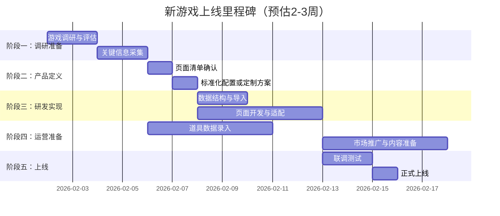

# 新游戏上线SOP（标准作业流程）

> **文档版本**：V1.0  
> **更新日期**：2025-01-22  
> **适用范围**：平台新增Roblox游戏时的全流程工作指南

---

## 一、概述

### 1.1 文档目的

本SOP旨在标准化新游戏上线的完整流程，确保：
- 各角色（产品、研发、运营）职责清晰
- 工作可复用、可量化
- 上线周期可预估（目标：2-3周完成一款新游戏）

### 1.2 角色定义

| 角色 | 简称 | 主要职责 |
|------|------|----------|
| 产品经理 | PM | 游戏调研、功能定义、页面配置、验收 |
| 前端研发 | FE | 页面开发、组件适配、配置系统维护 |
| 后端研发 | BE | 数据结构设计、API开发、数据导入 |
| 运营 | OP | 道具数据采集、社媒准备、内容运营 |

### 1.3 里程碑概览



---

## 二、阶段一：游戏调研与评估（PM主导，2天）

### 2.1 调研Checklist

#### 2.1.1 游戏基础信息

| 调研项 | 说明 | 产出示例 |
|--------|------|----------|
| 游戏名称 | 官方英文名 | Blox Fruits |
| gameKey | URL路径标识（小写无空格） | `bloxfruits` |
| 游戏链接 | Roblox官方链接 | `https://www.roblox.com/games/xxx` |
| 游戏简介 | 50-100字描述 | 基于海贼王的动作冒险游戏... |
| 目标用户画像 | 年龄、地区、偏好 | 欧美13-18岁男性为主 |
| 月活跃玩家数 | 预估DAU/MAU | 500K+ DAU |
| 搜索热度 | Google Trends数据 | 月搜索量50K+ |

#### 2.1.2 交易系统信息

| 调研项 | 说明 | GAG示例 | BF示例 |
|--------|------|---------|--------|
| 是否有官方交易系统 | 游戏内是否支持玩家交易 | 是 | 是 |
| 单次交易道具上限 | 每次交易最多放几个道具 | 12 | 4 |
| 交易货币类型 | 游戏内货币名称 | Tokens | Beli |
| 是否支持货币交易 | 交易中能否加货币 | 是（Tokens） | 否 |
| 交易限制条件 | 等级、会员、价值等限制 | 无 | 价差限制 |
| 交易流程 | 具体操作和界面上的主要信息 | 交易面板、提示信息 | 其他 |

#### 2.1.3 可交易道具类型

| 调研项 | 说明 | GAG示例 | BF示例 |
|--------|------|---------|--------|
| 道具大类 | 主要道具分类 | Pets, Seeds, Gear | Fruits, Gamepasses, Limiteds |
| 稀有度体系 | 稀有度等级名称 | Common/Rare/Epic/Legendary/Mythic | Common/Uncommon/Rare/Legendary/Mythical |
| 特殊道具标签 | 需特殊提示的道具类型 | Mutant, Event Limited | Permanent, Physical |
| 道具总数（预估） | 可交易道具数量 | 200+ | 100+ |
仅列出主要字段，参考已有表格，根据实际游戏情况丰富关键字段

#### 2.1.4 价值体系信息

| 调研项 | 说明 | 产出 |
|--------|------|------|
| 主流价值参考源 | 玩家社区认可的价值表 | Discord/Wiki链接 |
| 价值计算逻辑 | 是否有公式或纯市场定价 | 市场供需 + 稀有度 |
| 价值单位 | 价值的计量单位 | Value / Beli / Robux |
| 价值波动频率 | 价值更新周期 | 每日/每周 |

### 2.2 评估决策矩阵

完成调研后，使用以下矩阵评估是否上线：

| 评估维度 | 权重 | 评分标准（1-5分） | 最低通过分 |
|----------|------|-------------------|------------|
| 搜索热度 | 30% | 5=50K+月搜索, 3=20K+, 1=<5K | 3 |
| 交易活跃度 | 25% | 5=官方交易系统成熟, 3=有交易需求, 1=几乎无交易 | 3 |
| 竞品情况 | 20% | 5=无竞品, 3=有竞品但不强, 1=强竞品垄断 | 2 |
| 实现复杂度 | 15% | 5=完全可复用, 3=需少量开发, 1=大量定制 | 2 |
| 内容获取难度 | 10% | 5=公开数据丰富, 3=需采集, 1=数据封闭 | 2 |

**综合评分 ≥ 3.5 分可进入下一阶段**

### 2.3 产出物

- [ ] 《XX游戏调研报告》（填充上述表格）
- [ ] 评估决策结论（通过/不通过）
- [ ] 如通过，确定目标上线日期

---

## 三、阶段二：产品定义与配置（PM主导，2天）

以下配置示例为理想情况，依赖前序工作：研发已完成核心、通用的配置抽象工作，支持PM直接进行可视化配置。具体可配置项还待产研实际讨论和细化。

### 3.1 GameConfig 配置

基于调研结果，填充游戏配置文件：

```
  // 基础信息
  gameKey: 'bloxfruits',
  displayName: 'Blox Fruits',
  shortName: 'BF',
  icon: '⚔️',  // 或图片路径
  logo: '/games/bloxfruits/logo.png',
  description: '基于海贼王的Roblox动作冒险游戏...',
  robloxGameId: '2753915549',
  
  // 交易配置
  trading: {
    maxItemsPerTrade: 4,           // 单次交易道具上限
    supportsCurrency: false,       // 是否支持货币交易
    currencyName: 'Beli',          // 货币名称
    currencyIcon: '💰',            // 货币图标
    valueDifferenceWarningThreshold: 0.4,  // 40%价值差异警告
    valueDifferenceBlockThreshold: 0.6,    // 60%价值差异阻止（如适用）
  },
  
  // 道具分类配置
  itemCategories: [
    { key: 'fruits', label: 'Fruits', icon: '🍎' },
    { key: 'gamepasses', label: 'Gamepasses', icon: '🎫' },
    { key: 'limiteds', label: 'Limiteds', icon: '🔫' },
  ],
  
  // 稀有度配置（颜色使用设计系统Token）
  rarities: [
    { key: 'common', label: 'Common', colorToken: 'rarity-common' },
    { key: 'uncommon', label: 'Uncommon', colorToken: 'rarity-uncommon' },
    { key: 'rare', label: 'Rare', colorToken: 'rarity-rare' },
    { key: 'legendary', label: 'Legendary', colorToken: 'rarity-legendary' },
    { key: 'mythical', label: 'Mythical', colorToken: 'rarity-mythical' },
  ],
   
  // 筛选器配置
  filters: {
    // 高级筛选字段
    advancedFilters: [
      { key: 'category', type: 'multi-select', options: 'itemCategories' },
      { key: 'rarity', type: 'multi-select', options: 'rarities' },
      { key: 'fruitsType', type: 'single-select', options: ['Permanent', 'Physical'], dependsOn: { category: 'fruits' } },
    ],
  },
  
  // SEO配置
  seo: {
    titleSuffix: 'Blox Fruits Trading',
    defaultDescription: 'Trade Blox Fruits items safely...',
     },
  
  // 功能开关（MVP阶段）
  features: {
    wiki: true,
    valueList: true,
    tradelist: true,
    calculator: true,
    tierList: true,
    articles: false,      // MVP不支持
    giveaways: false,     // MVP不支持
  },
  
  // 主题配置
  theme: {
    primaryColor: 'hsl(220, 70%, 50%)',  // 游戏主色调
    accentColor: 'hsl(35, 90%, 55%)',    // 强调色
  },
};
```

### 3.2 页面配置清单

基于已有多游戏架构，确认各页面的配置项：

| 页面 | 配置类型 | 主要配置项 | PM需确认 |
|------|----------|------------|----------|
| **导航栏** | 轻量配置 | 游戏切换逻辑、Logo、菜单项 | ✅ |
| **Footer** | 轻量配置 | 游戏资源链接 | ✅ |
| **游戏首页** | 模板配置 | Hero文案、统计数据来源、工具入口 | ✅ |
| **订单列表页** | 模板配置 | 筛选器字段、排序选项、卡片道具槽数 | ✅ |
| **订单详情页** | 模板配置 | 道具展示区、价值计算、交易提示 | ✅ |
| **创建交易页** | 模板配置 | 道具选择器、价值校验规则、提示文案 | ✅ |
| **道具选择弹窗** | 组件配置 | 筛选字段、搜索placeholder | ✅ |
| **参数设置弹窗** | 组件配置 | 可配参数字段（如变异、等级） | ✅ |
| **道具信息卡片** | 组件配置 | 展示字段、徽章逻辑 | ✅ |
| **Wiki详情页** | 模板配置 | 字段结构（技能、属性等） | ✅ |
| **Value列表页** | 模板配置 | 排序维度、分类tab | ✅ |
| **计算器页** | 逻辑配置 | 价值计算公式、对比规则 | ✅ |


### 3.3 页面配置确认表

PM需逐项确认并填写：

```yaml
# 页面配置确认表 - {游戏名称}

## 1. 订单列表页
hero_title: "All Tradeable Fruits & Items in Blox Fruits"
hero_subtitle: "Find and trade items with other players"
statistics:
  - key: ongoing_trades
    label: "Ongoing Trades"
  - key: completed_trades  
    label: "Completed Trades"
tool_entries:
  - label: "Blox Fruits Wiki"
    link: "/{gameKey}/wiki"
  - label: "Trade Value Calculator"
    link: "/{gameKey}/tradecalculator"
search_placeholder: "Search fruits or items..."
filter_button_text: "Item Filters"

## 2. 创建交易页
max_items_per_side: 4
value_currency_label: "Total Beli Value"
supports_token_input: false
value_warning_scenarios:
  - type: "block"
    condition: "差值>40%"
    message: "Trade value difference exceeds 40%. Please adjust items."
  - type: "warning"
    condition: "特殊道具"
    message: "Special items detected. View Trading Guidelines."

## 3. 道具选择弹窗  
filter_fields:
  - key: category
    label: "Category"
    type: multi-select
  - key: rarity
    label: "Rarity"
    type: multi-select
  - key: fruitsType
    label: "Fruits Type"
    type: single-select
    depends_on: category=fruits
    
## 4. How to Trade 文案
cards:
  - icon: "🛡️"
    title: "Safe Trading"
    content: "Always use the official in-game trading system..."
  - icon: "📊"
    title: "Value Assessment"  
    content: "Check the Item Value List for your game..."
  - icon: "⏰"
    title: "Timing Your Trades"
    content: "Values fluctuate based on game events..."
```

### 3.4 产出物

- [ ] `src/config/games/{gameKey}.ts` 配置文件（PM填写，FE审核）
- [ ] 页面配置确认表（YAML格式）
- [ ] 特殊业务逻辑说明文档（如有）

---

## 四、阶段三：研发实现（FE/BE主导，5-7天）

### 4.1 后端工作（BE）

#### 4.1.1 数据结构准备

| 任务 | 说明 | 预估时间 |
|------|------|----------|
| items表游戏字段 | 确认items表game_key字段支持新游戏值 | 0.5d |
| 道具数据模型 | 确认新游戏道具的特有字段（如BF的fruitsType） | 0.5d |
| 数据导入脚本 | 编写/复用道具批量导入脚本 | 1d |


#### 4.1.2 数据导入Checklist

```bash
# 道具数据CSV格式要求
id,game_key,name,slug,category,rarity,image_url,value,description,special_tags
uuid,bloxfruits,Dragon,dragon,fruits,mythical,/items/bf/dragon.png,50000000,"...",permanent
```

| 字段 | 必填 | 说明 |
|------|------|------|
| id | 是 | UUID，自动生成 |
| game_key | 是 | 游戏标识，如`bloxfruits` |
| name | 是 | 道具英文名 |
| slug | 是 | URL友好标识 |
| category | 是 | 道具分类 |
| rarity | 是 | 稀有度 |
| image_url | 是 | 道具图片路径 |
| value | 是 | 当前价值 |
| description | 否 | Wiki描述 |
| special_tags | 否 | 特殊标签，逗号分隔 |

### 4.2 前端工作（FE）

#### 4.2.1 配置驱动开发流程


#### 4.2.2 开发任务清单（按优先级）

| 优先级 | 任务 | 预估时间 | 依赖 |
|--------|------|----------|------|
| P0 | 注册GameConfig到配置中心 | 0.5d | PM配置 |
| P0 | 验证路由自动生成 | 0.5d | 配置注册 |
| P0 | 订单列表页适配验证 | 1d | 路由 |
| P0 | 创建交易页适配验证 | 1d | 路由 |
| P0 | 道具选择弹窗适配 | 0.5d | 创建交易页 |
| P0 | 订单详情页适配验证 | 1d | 路由 |
| P1 | 游戏首页配置 | 1d | 路由 |
| P1 | 导航栏游戏切换 | 0.5d | 配置 |
| P1 | Footer资源链接 | 0.5d | 配置 |
| P2 | Wiki详情页（如需新字段） | 1d | 数据模型 |
| P2 | 计算器逻辑适配 | 0.5d | 价值数据 |

#### 4.2.3 自检清单

开发完成后，FE需自检：

- [ ] 所有页面在 `/{gameKey}/xxx` 路径下正常访问
- [ ] 游戏切换后，导航栏状态正确
- [ ] 道具选择器筛选功能正常
- [ ] 道具卡片展示所有必要信息
- [ ] 交易创建流程完整（含价值校验）
- [ ] 移动端响应式布局正常
- [ ] 无控制台报错
- [ ] SEO TDK正确渲染

### 4.3 产出物

- [ ] 数据库迁移记录
- [ ] 道具数据导入完成
- [ ] 所有页面开发完成
- [ ] 自检通过

---

## 五、阶段四：运营准备（OP主导，与研发并行）

### 5.1 道具数据采集

#### 5.1.1 数据来源

| 数据类型 | 主要来源 | 备选来源 |
|----------|----------|----------|
| 道具列表 | 游戏官方Wiki | Fandom Wiki |
| 道具图片 | 游戏内截图 | 社区资源 |
| 价值数据 | 主流价值表Discord | 社区投票 |
| 道具描述 | 官方Wiki | 人工编写 |

#### 5.1.2 采集任务表

| 任务 | 负责人 | 截止日期 | 状态 |
|------|--------|----------|------|
| 采集所有可交易道具名称 | OP | D+3 | ⬜ |
| 采集道具分类和稀有度 | OP | D+3 | ⬜ |
| 采集/制作道具图片 | OP | D+5 | ⬜ |
| 采集初始价值数据 | OP | D+5 | ⬜ |
| 整理为CSV格式 | OP | D+6 | ⬜ |
| 提交BE导入 | OP | D+7 | ⬜ |

#### 5.1.3 数据质量检查

- [ ] 所有道具名称英文拼写正确
- [ ] 分类和稀有度与游戏内一致
- [ ] 图片尺寸统一（建议256x256）
- [ ] 无重复道具
- [ ] 特殊标签标注完整

### 5.2 社媒与内容准备

#### 5.2.1 社媒账号准备

| 平台 | 任务 | 负责人 | 状态 |
|------|------|--------|------|
| Discord | 创建游戏专属频道 | OP | ⬜ |
| Twitter/X | 准备上线预告文案 | OP | ⬜ |
| Youtube | 创建游戏专属播放列表，准备内容 | OP | ⬜ |
| TikTok | 准备短视频素材 | OP | ⬜ |
| Reddit | 确定目标社区 | OP | ⬜ |

#### 5.2.2 上线公告模板

```markdown
# 🎉 [游戏名称] Trading Now Live!

We're excited to announce that [游戏名称] is now supported on our platform!

## What's Available:
- ✅ Full item trading marketplace
- ✅ Real-time value tracking
- ✅ Comprehensive item wiki
- ✅ Trade value calculator

## Get Started:
1. Visit [URL]
2. Create or find trades
3. Connect with other players

Join our Discord for the latest updates: [Discord链接]

#[游戏名称] #RobloxTrading #[相关Hashtag]
```

#### 5.2.3 内容日历（上线前后1周）

| 日期 | 平台 | 内容类型 | 状态 |
|------|------|----------|------|
| D-3 | Discord | 预告：即将支持新游戏 | ⬜ |
| D-1 | Twitter | 倒计时海报 | ⬜ |
| D-Day | 全平台 | 上线公告 | ⬜ |
| D+1 | Discord | 使用教程 | ⬜ |
| D+2 | YT/TikTok | 交易演示视频 | ⬜ |
| D+7 | Twitter | 首周数据回顾 | ⬜ |

### 5.3 产出物

- [ ] 道具数据CSV文件
- [ ] 道具图片资源包
- [ ] 社媒内容素材
- [ ] 上线公告文案

---

## 六、阶段五：测试与上线（全员，2-3天）

### 6.1 测试Checklist

#### 6.1.1 功能测试（FE主导）

| 测试项 | 测试点 | 通过 |
|--------|--------|------|
| **导航** | 游戏切换正常 | ⬜ |
| **导航** | Logo和菜单项正确 | ⬜ |
| **订单列表** | 筛选器功能正常 | ⬜ |
| **订单列表** | 道具卡片展示正确 | ⬜ |
| **订单列表** | 分页正常 | ⬜ |
| **创建交易** | 道具选择器正常 | ⬜ |
| **创建交易** | 价值计算正确 | ⬜ |
| **创建交易** | 价值差异警告触发 | ⬜ |
| **创建交易** | 特殊道具提示显示 | ⬜ |
| **订单详情** | 信息展示完整 | ⬜ |
| **订单详情** | 报价功能正常 | ⬜ |
| **聊天** | 游戏图标标识正确 | ⬜ |
| **用户中心** | 游戏数据切换正常 | ⬜ |


#### 6.1.2 SEO测试

| 测试项 | 检查点 | 通过 |
|--------|--------|------|
| TDK | 各页面Title、Description正确 | ⬜ |
| 结构化数据 | JSON-LD渲染正确 | ⬜ |
| Sitemap | 新游戏页面已加入 | ⬜ |
| Canonical | 无重复URL问题 | ⬜ |
| 移动端 | Mobile-friendly测试通过 | ⬜ |


#### 6.1.3 数据验证（OP验证）

| 测试项 | 检查点 | 通过 |
|--------|--------|------|
| 道具数量 | 与采集数量一致 | ⬜ |
| 道具图片 | 全部正常显示 | ⬜ |
| 价值数据 | 主要道具价值正确 | ⬜ |
| 分类筛选 | 各分类道具数量正确 | ⬜ |


### 6.2 上线流程

#### 6.2.1 上线前确认

- [ ] 所有测试项通过
- [ ] 社媒内容准备就绪
- [ ] Discord公告准备就绪
- [ ] 回滚方案确认


#### 6.2.2 上线步骤

```
1. [BE] 确认生产环境数据就绪
2. [FE] 合并代码到生产分支
3. [FE] 触发生产部署
4. [PM] 验证生产环境页面
5. [OP] 发布社媒公告
6. [OP] Discord公告
7. [全员] 监控1小时
```


#### 6.2.3 上线后监控

| 监控项 | 工具 | 负责人 | 频率 |
|--------|------|--------|------|
| 页面错误 | Sentry | FE | 实时 |
| 用户反馈 | Discord | OP | 每小时 |
| 流量数据 | Analytics | PM | 每日 |
| SEO索引 | Google Search Console | PM | 每日 |


### 6.3 产出物

- [ ] 测试报告
- [ ] 上线确认邮件
- [ ] 上线后监控日报（首周）

---

## 七、附录

### 7.1 文件清单模板

新游戏上线需准备/生成的文件：

```
docs/
├── prd/
│   └── {gameKey}-上线PRD.md          # PM产出

src/
├── config/
│   └── games/
│       └── {gameKey}.ts              # 游戏配置文件
├── assets/
│   └── games/
│       └── {gameKey}/
│           ├── logo.png              # 游戏Logo
│           └── banner.png            # 首页Banner

public/
├── items/
│   └── {gameKey}/
│       └── *.png                     # 道具图片

data/
└── imports/
    └── {gameKey}/
        └── items.csv                 # 道具数据CSV
```

### 7.2 常见问题FAQ

#### Q1: 如果游戏交易规则与现有模板差异很大怎么办？
A: 评估定制开发工作量，如超过3天，需单独立项，不适用本SOP。

#### Q2: 道具数据量很大（200+）如何处理？
A: 分批导入，优先导入高价值、高交易频率道具，其余迭代补充。

#### Q3: 上线后发现数据错误如何处理？
A: OP提供修正数据，BE执行更新脚本，无需重新部署前端。

#### Q4: 如何判断游戏是否值得支持？
A: 参考2.2评估决策矩阵，综合评分≥3.5分可考虑上线。

### 7.3 版本历史

| 版本 | 日期 | 修改人 | 修改内容 |
|------|------|--------|----------|
| V1.0 | 2025-01-22 | 雪竹 | 初始版本，基于BF上线经验整理 |

---

## 八、快速参考卡片

### 8.1 PM快速参考

```
✅ 调研游戏（2天）
   → 填写调研Checklist
   → 完成评估决策矩阵
   
✅ 产品定义（2天）
   → 编写GameConfig配置
   → 确认页面配置表
   
✅ 验收测试（1天）
   → SEO验证
   → 功能走查
```

### 8.2 FE快速参考

```
✅ 配置注册（0.5天）
   → 导入GameConfig
   → 验证路由生成
   
✅ 页面适配（3-5天）
   → P0页面优先
   → 组件参数检查
   
✅ 自检发布（1天）
   → 功能自检清单
   → 响应式验证
```

### 8.3 OP快速参考

```
✅ 数据采集（5天，与研发并行）
   → 道具信息整理
   → 图片资源准备
   → CSV格式化
   
✅ 内容准备（2天）
   → 社媒账号
   → 上线公告
   → 内容日历
```

---

*本文档由产品团队维护，如有问题请联系PM*
